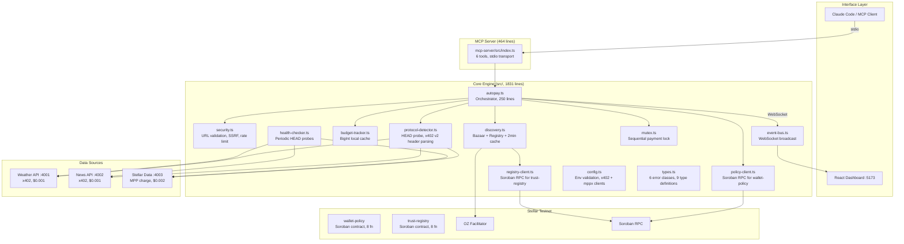
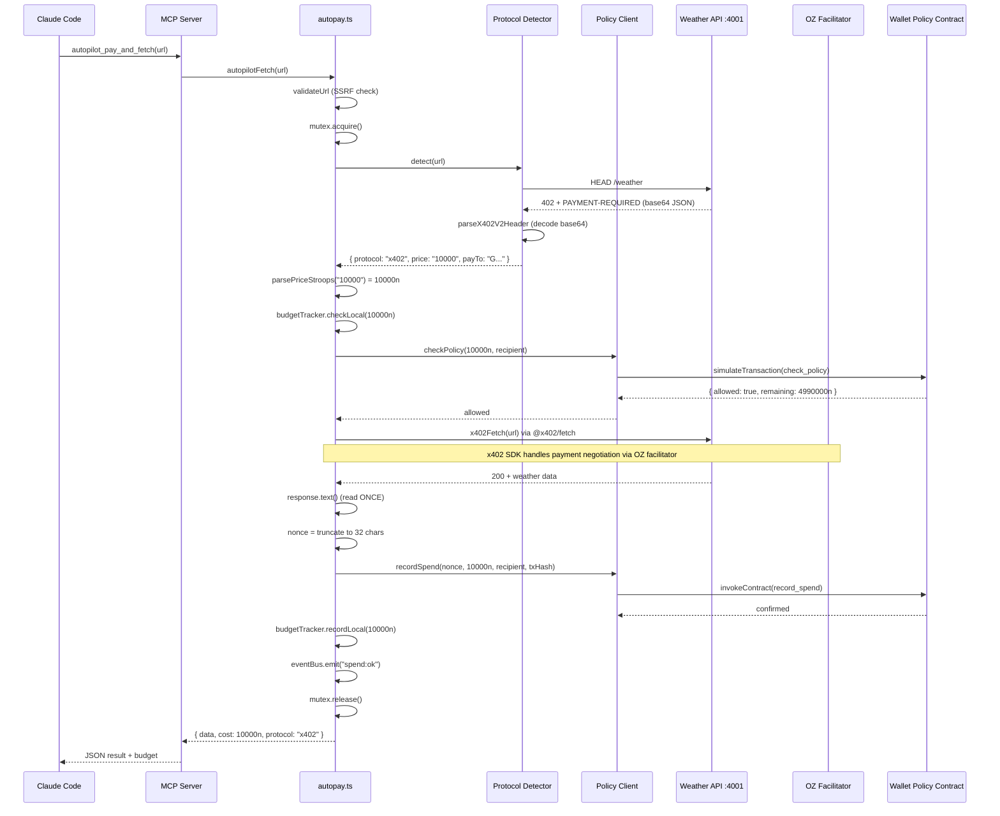
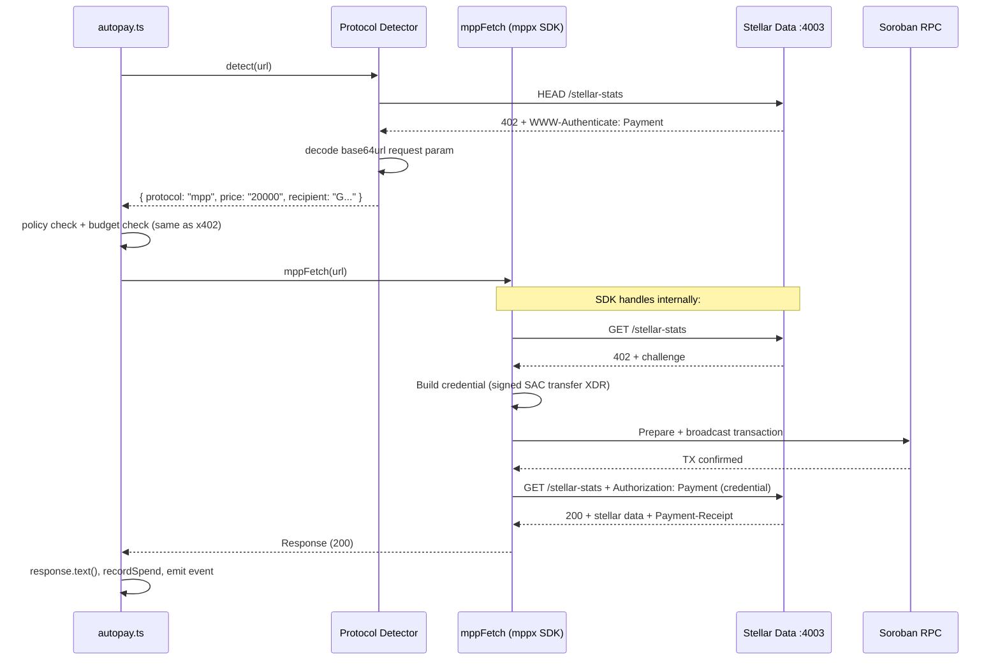
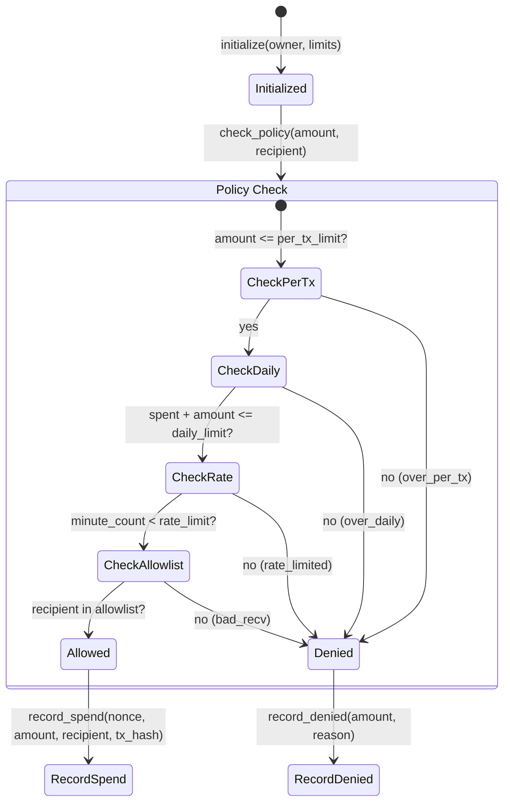
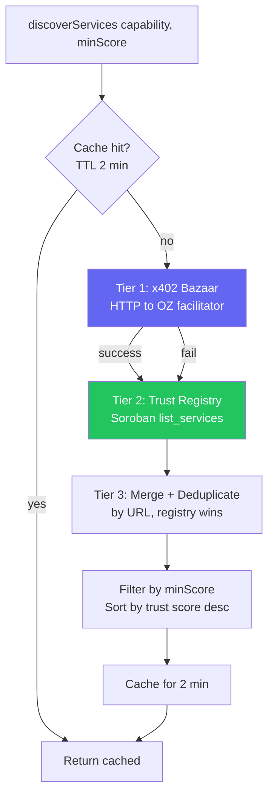

# Architecture

## System overview



## Directory structure

```
x402-autopilot/
  CLAUDE.md                     Build specification
  README.md                     Hackathon submission
  ARCHITECTURE.md               This file
  package.json                  Root workspace + scripts
  tsconfig.json                 Strict, ES2022, NodeNext

  contracts/
    wallet-policy/
      Cargo.toml                soroban-sdk 22.0.0
      src/lib.rs                8 pub fn, 353 lines
    trust-registry/
      Cargo.toml                soroban-sdk 22.0.0
      src/lib.rs                8 pub fn, 351 lines

  src/                          12 modules, 1831 lines total
    types.ts                    6 error classes, 9 type definitions (149 lines)
    config.ts                   Env validation, keypair, x402 + mppx clients (126 lines)
    security.ts                 validateUrl, parsePriceStroops, RateLimiter (117 lines)
    mutex.ts                    AsyncMutex with 30s timeout (41 lines)
    event-bus.ts                EventBus + WebSocket broadcast (65 lines)
    budget-tracker.ts           BigInt local cache, sync from Soroban (88 lines)
    policy-client.ts            checkPolicy, recordSpend, updatePolicy (316 lines)
    registry-client.ts          listServices, reportQuality, heartbeat (223 lines)
    protocol-detector.ts        HEAD probe, x402 v2 + MPP header parsing (201 lines)
    discovery.ts                Bazaar + Registry + 2min cache (144 lines)
    health-checker.ts           5-minute interval HEAD probes (111 lines)
    autopay.ts                  Main orchestrator (250 lines)

  mcp-server/src/
    index.ts                    6 tools, Server + StdioServerTransport (464 lines)

  data-sources/src/
    shared.ts                   x402 server factory, self-registration helper
    weather-api.ts              Express + paymentMiddleware, port 4001
    news-api.ts                 Express + paymentMiddleware, port 4002
    stellar-data-api.ts         Express + mppx/express, port 4003

  dashboard/src/
    main.tsx                    React root
    App.tsx                     5 panels, dark theme (543 lines)
    hooks/useWebSocket.ts       useReducer, auto-reconnect, backoff (140 lines)

  scripts/
    setup-testnet.ts            Fund wallet, add USDC trustline
    deploy-wallet-policy.sh     Build + deploy + initialize
    deploy-trust-registry.sh    Build + deploy + initialize
    seed-registry.ts            Register 3 demo services
    run-demo.ts                 Full demo flow (recordable)
    health-report.ts            CLI health check table

  skill/
    SKILL.md                    OpenClaw skill definition
```

Total: 26 TypeScript/TSX files, 2 Rust contract files, 2 shell scripts.

## Payment flow (x402)



## Payment flow (MPP charge)

The MPP path uses the mppx SDK client. `Mppx.create({ polyfill: false })` returns a scoped `.fetch()` that handles the full 402 challenge-response-credential cycle without polyfilling globalThis.fetch. This coexists cleanly with the x402 fetch wrapper.



## Wallet policy contract

On-chain source of truth for spending limits. All money amounts are i128 (stroops).



**8 functions:**

| Function | Type | Purpose |
|----------|------|---------|
| `initialize` | write | Set owner, daily/per-tx/rate limits |
| `check_policy` | read | Check all limits, return allowed/denied + remaining |
| `record_spend` | write | Record confirmed spend, nonce dedup (Symbol max 32 chars) |
| `record_denied` | write | Increment denied count, emit event |
| `update_policy` | write | Change limits (owner auth) |
| `set_allowlist` | write | Set recipient whitelist (owner auth) |
| `get_today_spending` | read | Current day spend record (day_key = timestamp/86400) |
| `get_lifetime_stats` | read | Total spent, tx count, denied count |

Storage: instance (policy, owner, allowlist) + persistent (spend records, nonces, lifetime).

## Trust registry contract

On-chain directory of paid API services with anti-spam deposits and trust scoring.

**8 functions:**

| Function | Type | Purpose |
|----------|------|---------|
| `initialize` | write | Set admin, USDC SAC address |
| `register_service` | write | Register + deposit 100,000 stroops ($0.01) |
| `deregister_service` | write | Remove + refund deposit |
| `heartbeat` | write | Prove service is alive (every ~720 ledgers) |
| `report_quality` | write | Success/fail report (max 1/reporter/service/day) |
| `list_services` | read | Filter by capability + min trust score |
| `get_service` | read | Get single service info |
| `check_stale` | write | Permissionless. >720 ledgers = stale, >7200 = removed |

Trust score: `successes * 100 / total_reports`. Default 70 for new services.

## Discovery pipeline



Bazaar services not in the registry get default score 70 and "unverified" badge. On payment failure, the specific service is invalidated from cache.

## Security model

| Threat | Mitigation | Location |
|--------|-----------|----------|
| SSRF via URL | Block file://, private IPs, localhost (unless ALLOW_HTTP) | security.ts |
| Overspend via prompt injection | On-chain policy check, allowlist enforcement | wallet-policy contract |
| Concurrent budget race | Async mutex, one payment at a time | mutex.ts |
| RPC downtime bypass | Fail-closed: RPC unreachable = payment denied | policy-client.ts |
| Replay attack | Nonce stored on-chain, duplicates rejected | wallet-policy contract |
| Nonce overflow | Truncated to 32 chars (Soroban Symbol limit) | autopay.ts |
| Registry spam | $0.01 USDC deposit, forfeited if service goes stale | trust-registry contract |
| Fake quality reports | Max 1 report per (reporter, service, day) | trust-registry contract |
| Secret exposure | Private key never exported/logged, masked in errors | config.ts, error paths |
| Response body consumed twice | .text() once, JSON.parse separately | autopay.ts |

## Dashboard events

The core engine emits events via WebSocket. The dashboard receives them as JSON with BigInt fields serialized to strings.

| Event | Source | Dashboard panel |
|-------|--------|----------------|
| `spend:ok` | autopay.ts | Transaction log (green OK badge) |
| `spend:api_error` | autopay.ts | Transaction log (red ERR badge) |
| `spend:failed` | autopay.ts | Transaction log (red FAIL badge) |
| `denied` | autopay.ts | Denied panel (red background) |
| `discovery:updated` | discovery.ts | Service registry table |
| `health:checked` | health-checker.ts | Health monitor |
| `budget:updated` | budget-tracker.ts | Budget panel + header |
| `registry:stale` | health-checker.ts | Health monitor (amber) |

## Design decisions

**BigInt everywhere for money.** JavaScript Number loses precision above 2^53. USDC has 7 decimal places. 1 USDC = 10,000,000 stroops. BigInt prevents rounding errors. The tradeoff: BigInt is not JSON-serializable, so every JSON.stringify needs a replacer function.

**Fail-closed on RPC failure.** If the Soroban RPC is down, `checkPolicy` returns `{ allowed: false, reason: "rpc_unavailable" }`. Allowing payments without policy check would defeat on-chain enforcement.

**Mutex for sequential payments.** Two concurrent autopilotFetch calls could both pass the budget check and overspend. The mutex ensures one-at-a-time. The tradeoff: payments queue up and total latency increases linearly.

**Separate fetch wrappers for x402 and MPP.** The x402 SDK (`@x402/fetch`) wraps globalThis.fetch. The mppx SDK also wants to wrap fetch. To prevent conflicts, `Mppx.create({ polyfill: false })` creates a scoped `mppFetch` that handles MPP payments without touching the global. The protocol detector decides which wrapper to use.

**2-minute cache for discovery.** Querying Soroban for every discover call is expensive (2-3 seconds). The cache balances freshness with latency. On payment failure, the specific service is invalidated immediately.

**Nonce truncated to 32 chars.** Soroban Symbols are limited to 32 characters. The nonce format is `n{base36_timestamp}_{txHash_prefix}` sliced to 32 chars. This provides uniqueness without exceeding the contract's storage key limit.
