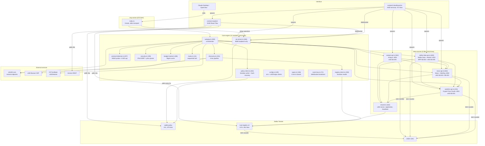
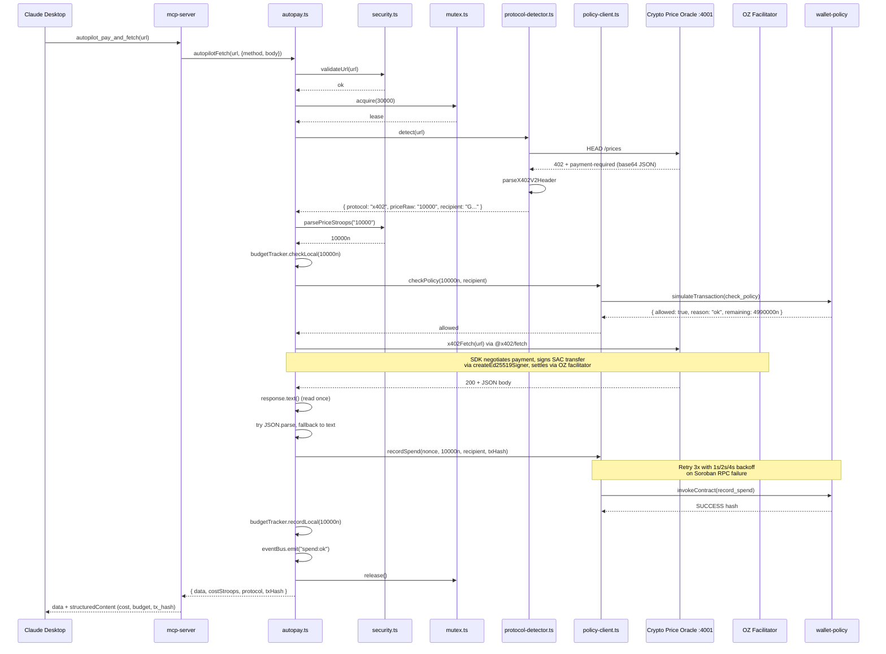
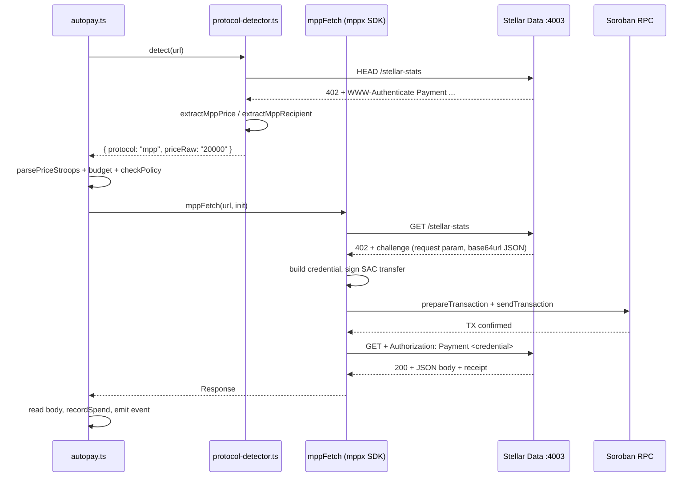
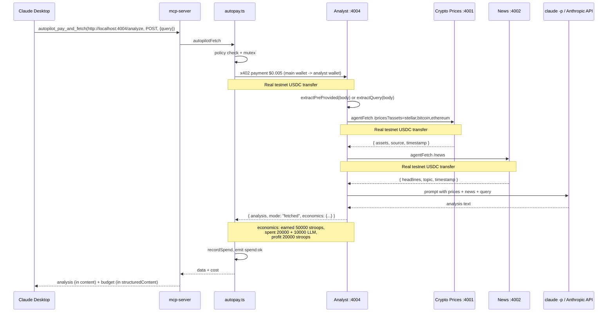
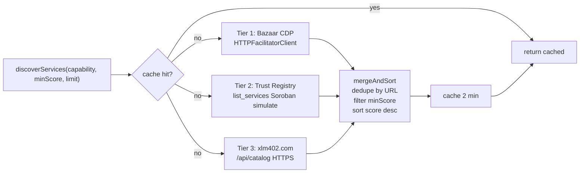
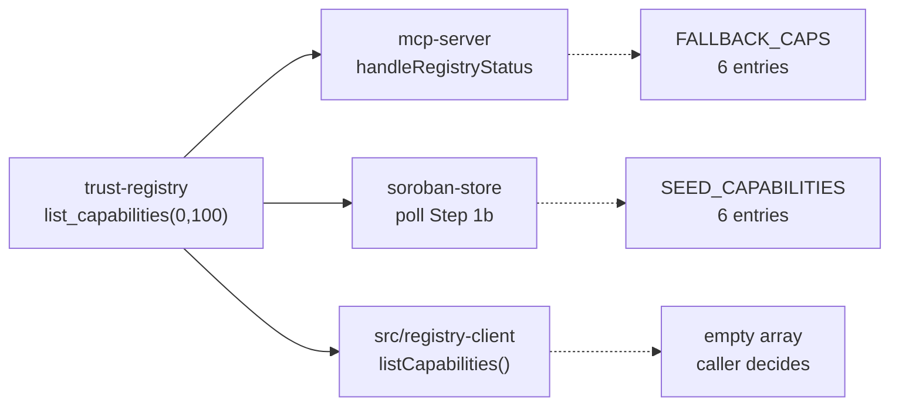
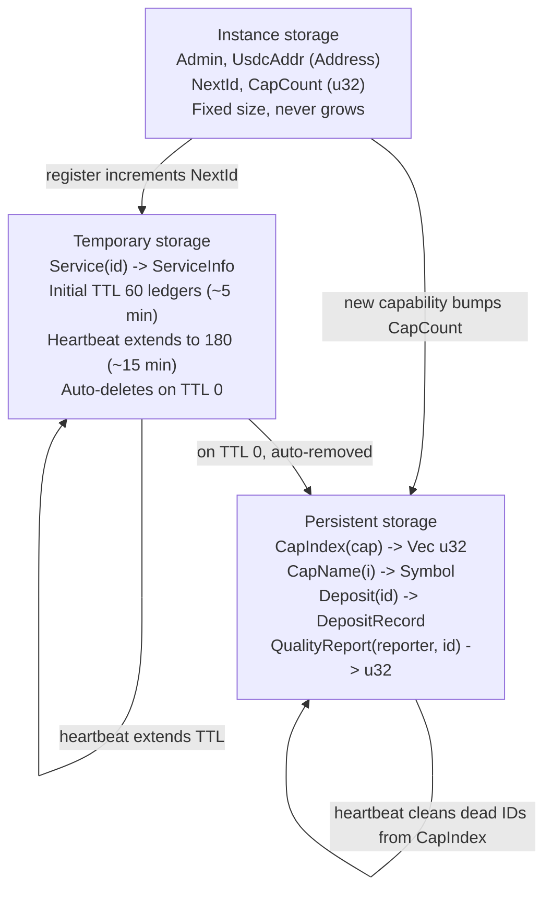
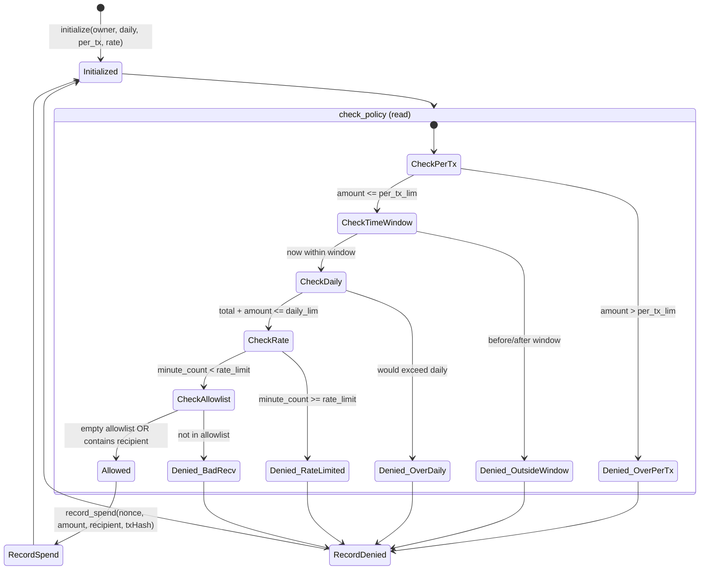
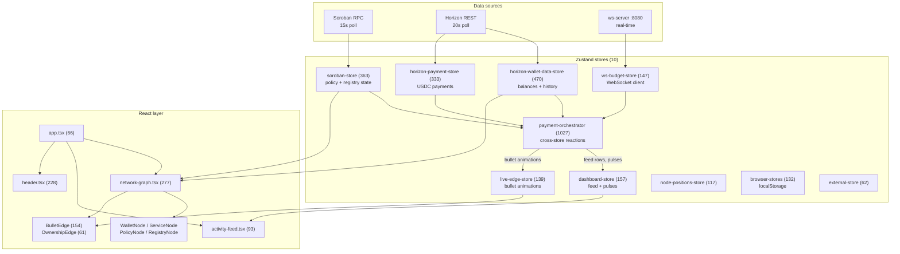

# Architecture

## System overview

x402 Autopilot is an autonomous payment engine for AI agents on Stellar. Claude (or any MCP-enabled agent) connects via stdio, discovers paid APIs through a 3-tier pipeline (Bazaar, on-chain trust registry, xlm402.com), pays with USDC micropayments, and tracks spending against an on-chain Soroban policy contract. Three of the four built-in data sources are themselves agents: they earn money from incoming requests and spend their own USDC to buy raw data from other agents before responding. A CLI dashboard manages the local process tree. A web dashboard (contract-explorer) renders a React Flow network graph with animated payment flows.

## Component diagram



## Payment flow: x402



## Payment flow: MPP charge



## Payment flow: agent-to-agent

The Analyst agent has its own keypair (`ANALYST_PRIVATE_KEY`/`ANALYST_PUBLIC_KEY`). It earns USDC from `/analyze` calls and spends USDC to buy raw data from the Crypto Price Oracle and the News service. Same code pattern is used in News Intelligence (buys prices) and Market Intelligence (buys prices and news).



When the caller passes pre-fetched data in `body.data.stories`, `body.stories`, or `body.data`, the analyst skips the paid sub-purchases and goes straight to the LLM. This keeps the round-trip under Claude Desktop's 60-second MCP tool cap.

## Discovery pipeline

Three tiers, deduplicated by URL (registry first), cached for 2 minutes per capability key.



| Tier | Source | Latency | Default trust score | Failure handling |
|------|--------|---------|---------------------|------------------|
| 1 | x402 Bazaar CDP via OZ facilitator | ~500ms HTTP | 70 | Try/catch, return [] |
| 2 | Soroban Trust Registry simulate | 2-3s | On-chain (default 70) | Try/catch, return [] |
| 3 | xlm402.com `/api/catalog` | 1-2s | 70 | Try/catch, return [] |

If any tier fails, the others still produce results. `invalidateService(url)` clears a single failing URL from every cached capability list, so the next discover call will not return it again until the cache repopulates from the live tiers.

## Dynamic capability discovery

Three of the system's read paths fetch the live capability set from the trust-registry instead of hardcoding it. The chain of trust is the same in all three: `list_capabilities(0, 100)` on the contract, fall back to a small hardcoded seed if the RPC is unreachable.



The contract write side that backs this is `register_service`. When a service registers under a capability that has not been seen before, the contract appends `CapName(CapCount)` and increments `CapCount`. The next `list_capabilities` call returns the new symbol. Net result: a service registering under `translation` (or any other new symbol) becomes discoverable by every client on its next poll cycle, with no code changes anywhere.

The MCP and dashboard fallbacks exist because a fresh deployment has zero capabilities indexed until the first service registers. Without the seed list the dashboard would render an empty registry node on first load.

## Trust registry storage layout

The trust-registry uses three Soroban storage tiers. Auto-expiry replaces the manual stale-checking pattern from earlier versions.



| Storage | Key | Value | TTL |
|---------|-----|-------|-----|
| instance | `Admin` | `Address` | extended on init to 100,000 |
| instance | `UsdcAddr` | `Address` | extended on init to 100,000 |
| instance | `NextId` | `u32` | 100,000 |
| instance | `CapCount` | `u32` (v3) | 100,000 |
| temporary | `Service(id)` | `ServiceInfo` | 60 (register) or 180 (heartbeat) ledgers |
| persistent | `CapIndex(capability)` | `Vec<u32>` | extended to 100,000 on every write |
| persistent | `CapName(i)` | `Symbol` (v3) | extended to 100,000 on every read and write |
| persistent | `Deposit(id)` | `DepositRecord{owner, amount}` | extended to 100,000 |
| temporary | `QualityReport(reporter, id)` | `u32` (day_key) | 17,280 ledgers (~24 h) |

**Why temporary storage for services.** When a service crashes without calling `deregister_service`, its TTL counts down. At 0 the entry vanishes. The next live heartbeat in the same capability scans `CapIndex` and writes back only the live IDs, removing the dead entry from the index. No background cleanup process is needed. The deposit record sits in persistent storage until either `deregister_service` (graceful) or `reclaim_deposit` (after expiry) refunds it.

**Registration re-entry.** `data-sources/src/shared.ts:resolveServiceId` calls `simulateListServices` before `register_service`. If the URL is already in the live set with the same owner, it reuses the existing service ID and resumes heartbeat instead of paying another deposit and panicking on the duplicate-URL check.

## Wallet policy state machine



`check_policy` returns one of seven `reason` symbols: `ok`, `over_per_tx`, `before_window`, `after_window`, `over_daily`, `rate_limited`, `bad_recv`. The TypeScript client surfaces these as `PolicyDeniedError.reason`. The MCP server reports them as a soft failure (no `isError` flag) so Claude can relay the reason without treating the tool as broken.

## Wallet policy contract

`contracts/wallet-policy/src/lib.rs` (353 lines, 8 public functions, all amounts in i128 stroops).

| Function | Type | Purpose | Auth |
|----------|------|---------|------|
| `initialize(owner, daily_limit, per_tx_limit, rate_limit)` | write | One-time setup, sets owner and policy | none (panics if reinitialized) |
| `check_policy(amount, recipient) -> PolicyRes` | read | Run all 5 checks, return `{allowed, reason, remaining}` | none |
| `record_spend(nonce, amount, recipient, tx_hash)` | write | Update day spend, emit event, panic on duplicate nonce | owner |
| `record_denied(amount, reason)` | write | Increment denied counter, emit event | owner |
| `update_policy(daily, per_tx, rate, time_start, time_end)` | write | Replace policy struct | owner |
| `set_allowlist(addresses)` | write | Replace allowlist (empty = allow all) | owner |
| `get_today_spending() -> SpendRec` | read | Today's `{total, count, last_min, min_count}` | none |
| `get_lifetime_stats() -> (i128, u64, u64)` | read | `(total_spent, tx_count, denied_count)` | none |

**Storage keys** (`DataKey` enum):

- `instance`: `Policy`, `Owner`, `Allowlist`, `DeniedCnt`
- `persistent`: `Spend(day_key)`, `Nonce(symbol)`, `TotalSpent`, `TxCount`

The `day_key` is `env.ledger().timestamp() / 86400`, so a new UTC day starts a fresh `SpendRec`. The `min_count` field tracks the rate-limit window: a request is rejected if `current_min == record.last_min && record.min_count >= policy.rate_limit`.

**Persistent TTL.** `record_spend` calls `extend_ttl(50_000, 100_000)` on every persistent key it touches: `Spend(day_key)`, `Nonce(symbol)`, `TotalSpent`, and `TxCount`. Without these explicit extensions, persistent storage on testnet defaults to ~4096 ledgers (~5.7 hours). The daily counter would silently reset mid-day after a quiet period and the owner could overspend the daily limit. Lifetime totals would also expire and reset to zero. The TTL extension ensures every key lives for at least the next ~5.7 days.

## Trust registry contract (v3)

`contracts/trust-registry/src/lib.rs` (561 lines, 10 public functions).

| Function | Type | Purpose | Auth |
|----------|------|---------|------|
| `initialize(admin, usdc_addr)` | write | Set admin + USDC SAC + NextId=0 + CapCount=0 | admin |
| `register_service(owner, url, name, capability, price, protocol) -> u32` | write | Collect $0.01 deposit, store in temporary, append to CapIndex, append to CapName index if new | owner |
| `heartbeat(service_id)` | write | Extend TTL to 180 ledgers, clean dead CapIndex entries | service owner |
| `deregister_service(service_id)` | write | Remove from temp + CapIndex, refund deposit | service owner |
| `list_services(capability, min_score, limit) -> Vec<ServiceInfo>` | read | Scan CapIndex by capability, filter, limit | none |
| `get_service(service_id) -> ServiceInfo` | read | Direct lookup from temporary | none |
| `list_capabilities(start, limit) -> Vec<Symbol>` | read | Paginated read of CapName(start..start+limit) | none |
| `get_capability_count() -> u32` | read | O(1) instance read of CapCount | none |
| `report_quality(reporter, service_id, success)` | write | Max 1 per reporter per service per day, recompute score | reporter |
| `reclaim_deposit(service_id, owner)` | write | Refund deposit after TTL expiry, only original owner | owner |

`DEPOSIT_AMOUNT` is hardcoded to `100_000` stroops ($0.01 USDC). Trust score defaults to 70; after the first quality report it becomes `(successful * 100) / total`.

**v3 capability index.** The contract maintains `CapCount` (a `u32` in instance storage) and `CapName(u32)` (a sparse `Symbol` index in persistent storage). When `register_service` is called with a capability symbol that has not been seen before, a new `CapName(CapCount)` entry is written and `CapCount` is incremented. Existing capabilities are detected by an O(n) scan over `CapName(0..CapCount)`. This is microseconds at <50 capabilities and is documented inline as a tradeoff against an O(1) `CapExists(Symbol)->bool` flag (which would cost an extra persistent write per registration).

The instance-storage cost of the index is exactly 4 bytes (`CapCount: u32`). The capability *names* live in separate persistent ledger entries that are loaded only when `list_capabilities` reads them. This is the documented anti-DoS pattern from <https://github.com/paltalabs/instance-persistent-dos-soroban>: a `Vec<Symbol>` in instance storage would grow unbounded and slow down every `heartbeat`, `register`, and `list_services` call until DoS, because instance storage is loaded in full on every contract invocation.

`list_capabilities(start, limit)` returns up to `limit` capability symbols starting at `start`. Clients call it with `(0, 100)` and paginate when the returned `Vec` is shorter than `limit`. Every read extends the TTL on the touched `CapName(i)` entries (50_000 / 100_000) so an actively polled registry never loses capability names. This is how `mcp-server` and the contract-explorer dashboard discover new service categories without code changes.

## CLI dashboard

`scripts/cli-dashboard.ts` (472 lines, zero new dependencies). Replaces `concurrently` as the process manager for `npm run dev`. Pure ANSI escape codes for rendering.

**Process management**

- Spawns 6 children: `engine` (ws-server), `crypto`, `news`, `market`, `analyst`, `vite` (contract-explorer dev server)
- Every child uses `detached: true` so it becomes a process group leader
- On shutdown, `process.kill(-pid, "SIGTERM")` kills the entire group (catches grandchildren)
- `killPorts()` on startup runs `fuser -k` against ports 8080, 4001-4004, 5180-5182 to free anything left over from a crashed previous session
- Does **not** spawn the MCP server (Claude Desktop launches it via stdio on demand)

**Terminal rendering**

- Uses the alternative screen buffer (`\x1b[?1049h` / `\x1b[?1049l`)
- `process.stdout.write` with `\x1b[H` (cursor home) and `\x1b[2K` (clear line) per row, no flicker
- Hidden cursor during rendering, restored on exit including the `uncaughtException` handler

**Live data**

- WebSocket client to `ws://localhost:8080`, reconnects every 3 seconds on failure
- Listens for `budget:updated` and `spend:ok` events broadcast by the ws-server
- Heartbeat lines from each child's stdout update `lastHB` (silent, only counter shown)

**Logging**

- Each child's stdout/stderr writes to `logs/YYYY-MM-DD_HH-mm-ss.log`
- ANSI codes stripped from `parseOutput` (so URL detection still works), but the raw line is preserved in the log

## Web dashboard (contract-explorer)

`contract-explorer/` (48 TS/TSX files, 7001 lines, separate `package.json` outside the npm workspace). Standalone React Flow network graph that visualizes wallets, services, and contracts in real time.



**Data flow.** Every external data source enters through a Zustand store. The PaymentOrchestrator (1027 lines) initializes once at module load (`src/app.tsx`) and subscribes to all data stores. When a Horizon payment lands or a Soroban spend event arrives, the orchestrator fires a glow pulse on the relevant wallet node, queues a bullet animation on the matching edge, and appends a row to the activity feed. No React component subscribes to external data directly. `useSyncExternalStore`-backed hooks bridge stores to the render tree.

**Configuration overrides via URL params:**

| Param | Default | Purpose |
|-------|---------|---------|
| `policy` | `CDUQ4RY3SIRQ7AX5HI2TMTBC527RZ54DS54GVXVDH54O2RQH7NPRH7MM` | wallet-policy contract ID |
| `registry` | `CBMZL7YHPV2UFDK7S7OQOE46TAPULOMKRK7W2OZONP3ZUXUA3S6RMRAJ` | trust-registry contract ID |
| `rpc` | `https://soroban-testnet.stellar.org` | Soroban RPC endpoint |

The wallet list is persisted to `localStorage` under `x402-autopilot.wallets.v1`. Add wallets via the header input field; the address bar URL is the only other source of truth.

`SEED_CAPABILITIES` in `contract-explorer/src/lib/constants.ts:38` is the list of capabilities the dashboard polls on every refresh: `crypto_prices`, `news`, `briefing`, `blockchain`, `market_intelligence`, `analysis`. New capabilities discovered via `register` events in the last 17,280 ledgers (~24 h) are merged in automatically without code changes.

See [contract-explorer/README.md](contract-explorer/README.md) for the full directory layout.

## File breakdown

```
contracts/
  wallet-policy/src/lib.rs          379 lines, 8 pub fn  (TTL extends in record_spend)
  trust-registry/src/lib.rs         561 lines, 10 pub fn (v3)

src/                                2215 lines total
  policy-client.ts                  402  Soroban writer + hash-recovery retry
  autopay.ts                        352  payment orchestrator
  ws-server.ts                      246  loopback bind, MCP relay, 5s Soroban poll
  discovery.ts                      231  3-tier discovery pipeline
  protocol-detector.ts              207  HEAD probe + 402 header parsing + 8KB cap
  security.ts                       195  SSRF (IPv6 + IPv4-mapped) + parsePriceStroops
  registry-client.ts                158  Soroban reader (listServices + listCapabilities)
  config.ts                         139  env validation, x402 + mppx clients
  types.ts                          136  6 error classes + interfaces
  budget-tracker.ts                  88  BigInt local cache
  event-bus.ts                       71  WebSocket broadcast + bigint serializer
  mutex.ts                           41  sequential payment lock

data-sources/src/                   2418 lines total
  stellar-data-api.ts               620  MPP stellar-stats + x402 market-report + monitor
  analyst-api.ts                    549  x402 analyze, agent-to-agent + LLM
  shared.ts                         532  x402 server, registration, heartbeat
  news-api.ts                       502  x402 news + briefing + LLM
  weather-api.ts                    215  x402 prices, CoinGecko upstream

mcp-server/src/
  index.ts                          670  6 tools, stdio transport, ws relay,
                                          dynamic capability discovery,
                                          set_policy input validation

contract-explorer/src/              7199 lines total, 48 files
  stores/  (10 files)              3056  Zustand stores
    payment-orchestrator.ts        1027   cross-store wiring
    horizon-wallet-data-store.ts    525   (uses /operations + asset_balance_changes)
    soroban-store.ts                392   (calls listCapabilities each poll)
    horizon-payment-store.ts        358   (streams /operations)
    dashboard-store.ts              157
    ws-budget-store.ts              147
    live-edge-store.ts              139
    browser-stores.ts               132
    node-positions-store.ts         117
    external-store.ts                62
  hooks/   (9 files)                860
    use-graph-layout.ts             592
    use-wallet-data-map.ts           86
    use-connection-status.ts         61
    use-browser-state.ts             50
    use-node-positions.ts            17
    use-horizon-payments.ts          17
    use-horizon-wallet-data.ts       14
    use-soroban.ts                   12
    use-live-edges.ts                11
  components/ (12 + 9 ui files)    2090
    network-graph.tsx               277
    header.tsx                      228
    feed-event.tsx                  158
    activity-feed.tsx                93
    dashboard-layout.tsx             88
    nodes/wallet-node.tsx           209
    nodes/service-node.tsx          175
    nodes/registry-node.tsx         115
    nodes/policy-node.tsx            79
    nodes/node-types.ts              18
    edges/bullet-edge.tsx           154
    edges/ownership-edge.tsx         61
    ui/ (9 shadcn components)       435
  lib/ (5 files)                   1113
    soroban-rpc.ts                  520   (adds listCapabilities)
    types.ts                        261
    horizon.ts                      127   (normalisePayment returns array)
    utils.ts                        106
    constants.ts                     99
  app.tsx + main.tsx + vite-env.d    80

scripts/                            1598 TS lines + 2 bash files
  setup-service-wallets.ts          548  generate, fund, trustline, USDC, allowlist, chmod 600
  cli-dashboard.ts                  472  ANSI terminal dashboard
  ensure-service-wallets.ts         149  predev fast-path
  seed-registry.ts                  121  manual capability registration
  run-demo.ts                       118  full demo flow
  setup-testnet.ts                  104  fund main wallet, add USDC trustline
  health-report.ts                   86  CLI health probe
  deploy-wallet-policy.sh                 build + deploy + initialize
  deploy-trust-registry.sh                build + deploy + initialize
```

## Security model

| Threat | Mitigation | Location |
|--------|-----------|----------|
| SSRF via URL | Block file://, private IPs (10/8, 127/8, 169.254/16, 172.16/12, 192.168/16, 0.0.0.0), localhost unless `ALLOW_HTTP=true` | `src/security.ts:38` |
| Overspend via prompt injection | On-chain `check_policy` enforces per-tx, daily, rate, and allowlist limits | `contracts/wallet-policy/src/lib.rs:99` |
| Concurrent budget race | 30s async mutex, one payment in flight at a time | `src/mutex.ts` |
| Soroban RPC down | Fail-closed: `checkPolicy` returns `{allowed:false, reason:"rpc_unavailable"}` | `src/policy-client.ts:202` |
| Replay attack | Nonce stored on-chain, contract panics on duplicate. Persistent TTL extended on every record_spend so the nonce set never ages out mid-day. | `contracts/wallet-policy/src/lib.rs:206` |
| Daily total reset (TTL) | record_spend extends Spend(day_key) TTL on every write. Without this the daily counter would expire after ~5.7h on testnet. | `contracts/wallet-policy/src/lib.rs:240` |
| Double-record from retry blip | invokeWithRetry threads `(hash: <hex>)` through every error and treats a "duplicate" panic on a retry as proof the prior attempt landed. Final getTransaction fallback covers the all-network-failed case. | `src/policy-client.ts:137` (hash compute), `src/policy-client.ts:241` (duplicate recovery), `src/policy-client.ts:265` (final fallback) |
| Registry spam | $0.01 USDC deposit collected via SAC transfer | `contracts/trust-registry/src/lib.rs:112` |
| Deposit lockup after long uptime | heartbeat extends Deposit(id) TTL on every call so reclaim_deposit stays available | `contracts/trust-registry/src/lib.rs:270` |
| CapIndex aging in steady-state | heartbeat ALWAYS extends CapIndex TTL (not only on cleanup writes) | `contracts/trust-registry/src/lib.rs:301` |
| Fake quality reports | Max 1 report per reporter per service per day, key includes day_key | `contracts/trust-registry/src/lib.rs:481` |
| Capability index DoS | `CapName(u32)` paginated persistent keys (NOT a `Vec` in instance storage). Instance entry adds 4 bytes total. | `contracts/trust-registry/src/lib.rs:431` |
| ws-server fake event injection | Bind defaults to 127.0.0.1; relay handler tags peers via `loopbackPeers` and rejects `_relay` from non-loopback connections. Override via `WS_BIND_ADDR` for trusted networks. | `src/ws-server.ts:27`, `src/ws-server.ts:74` |
| `.env` world-readable | `setup-service-wallets.ts` calls `chmodSync(ENV_PATH, 0o600)` after every write | `scripts/setup-service-wallets.ts:255` |
| Hostile 402 header CPU burn | `MAX_PAYMENT_HEADER_LENGTH = 8192` cap on x402 v2 base64 and MPP request blobs | `src/protocol-detector.ts:117` |
| Hostile price string DoS | `MAX_PRICE_STRING_LENGTH = 64` cap in `parsePriceStroops` | `src/security.ts:172` |
| Negative-value policy lockout | `handleSetPolicy` validates non-negative integer inputs before signing | `mcp-server/src/index.ts:471` |
| Secret exposure in errors | `maskKey()` for Stellar keys, `Bearer ***` for API keys, regex strip in `mcp-server/src/index.ts:fail` | `src/config.ts:29`, `mcp-server/src/index.ts:138` |
| Response body consumed twice | Single `.text()` then `JSON.parse` separately | `src/autopay.ts:138` |
| HEAD 200 but GET 402 | `classifyFreeAs402` re-detects from response and falls through to payment | `src/autopay.ts:283` |
| Leftover ports on restart | `killPorts()` runs `fuser -k` on ports 4001-4004, 5180-5182, 8080 | `scripts/cli-dashboard.ts:97` |
| Float precision in money | BigInt stroops everywhere, `parsePriceStroops` is the only place `parseFloat` is allowed and is bounded by `Number.MAX_SAFE_INTEGER` | `src/security.ts:89` |

## Dashboard events

Events broadcast over WebSocket from `ws-server.ts`. BigInt fields are serialized to strings (the JSON replacer handles this).

| Event | Source | Payload |
|-------|--------|---------|
| `budget:updated` | ws-server polling (every 5s) and on connect | `spentToday`, `remaining`, `dailyLimit`, `txCount`, `deniedCount`, `lifetimeSpent` |
| `spend:ok` | ws-server polling delta + MCP relay | `url`, `amount`, `protocol`, `txHash`, `recipient`, `timestamp` |

The MCP server connects as a WebSocket client to the ws-server (`ws://localhost:8080`) with exponential backoff (1s up to 10s) and forwards `spend:ok` events from the autopay engine the moment they fire. This bypasses the 5-second polling window so the dashboard can render bullet animations the instant the payment lands instead of waiting for the next Soroban poll cycle.

The core engine's `event-bus.ts` defines a wider event union (`spend:api_error`, `spend:failed`, `denied`, `discovery:updated`, `health:checked`, `registry:stale`) but the wire protocol only emits `budget:updated` and `spend:ok` from the ws-server today.

## Design decisions

**BigInt everywhere for money.** JavaScript Numbers lose integer precision above 2^53. USDC has 7 decimals, so $1.00 = 10,000,000 stroops, well below 2^53, but products and sums quickly overflow without BigInt. `parsePriceStroops` is the only place `parseFloat` is allowed and it has explicit bounds checks. JSON.stringify cannot serialize BigInt natively, so every WebSocket emit uses a replacer function (`(_k, v) => typeof v === "bigint" ? v.toString() : v`).

**Fail-closed on RPC failure.** `checkPolicy` returns `{allowed:false, reason:"rpc_unavailable"}` if the Soroban RPC is unreachable. There is no "log and continue" fallback. If the on-chain enforcement layer cannot be queried, no payment goes out.

**Mutex for sequential payments.** Two concurrent calls into `autopilotFetch` could both pass the policy check before either records its spend, then both spend. The 30-second lease in `src/mutex.ts` serializes them. Tradeoff: payments queue up, latency adds linearly under load. The MCP server itself is single-client (Claude Desktop), so this is rarely an issue in practice.

**Separate fetch wrappers for x402 and MPP.** `@x402/fetch` wraps `globalThis.fetch`. `mppx` also wants to wrap `fetch`. To avoid the polyfill collision, `Mppx.create({ polyfill: false })` returns a scoped `mppFetch` and the protocol detector decides which wrapper to call.

**2-minute discovery cache.** Querying Soroban for every `discover` call would cost 2-3 seconds per request. The cache trades freshness for latency. On payment failure, `invalidateService(url)` removes a single failing URL from every cached capability list so the next discover will not return it.

**Temporary storage for service entries.** The trust-registry stores `ServiceInfo` in Soroban temporary storage with TTL extended by heartbeat. When a service crashes, its entry vanishes on TTL expiry instead of accumulating forever. Living services clean dead IDs out of the persistent `CapIndex` during their next heartbeat. This eliminates the instance-storage DoS that earlier registry versions were vulnerable to.

**Analyst as a real wallet.** The analyst has its own keypair, its own x402 client (`createEd25519Signer(ANALYST_SECRET, ...)`), and signs its sub-purchases with its own key. The dashboard shows ownership edges from each agent's wallet to its service node so the topology is visible at a glance. A bug where every service registered under the main wallet would collapse all ownership edges onto a single node and make the network look broken.

**`claude -p` headless before Anthropic API.** The three agent endpoints (analyst, news_intelligence, market_intelligence) prefer `claude -p` because it uses the local OAuth subscription, no API key needed. They fall back to `ANTHROPIC_API_KEY` if `claude -p` fails. They fall back again to a raw merged data response if neither LLM path is available, with `llm_mode: "raw_data_fallback"` flagged in the response. The subprocess uses explicit `proc.stdin.write(prompt); proc.stdin.end()` to avoid the stdin-hang bug fixed in Claude Code 2.1.80+.

**CLI dashboard over `concurrently`.** The fixed-layout ANSI display gives a single source of truth for service status, budget, and last transaction. Process groups with negative-PID kill ensure `Ctrl+C` cleans up grandchildren too. Port cleanup on startup handles interrupted previous sessions. The dashboard never spawns the MCP server; that is Claude Desktop's job.

**Registration re-entry on restart.** If a service restarts within its TTL window (5-15 minutes depending on heartbeat history), `shared.ts:resolveServiceId` lists existing registrations and reuses the previous service ID instead of paying another deposit and panicking on the duplicate-URL check. Operationally this means a `npm run dev` restart costs nothing and resumes within seconds.

**Contract-explorer as a separate app.** The web dashboard lives in `contract-explorer/` with its own `package.json`, not part of the npm workspace. It reads Soroban contract state via `simulate` (read-only) and Horizon REST directly. The only backend dependency is the optional ws-server WebSocket for real-time spend events. This means it can point at any deployment's contracts via URL params without needing the core engine running.
