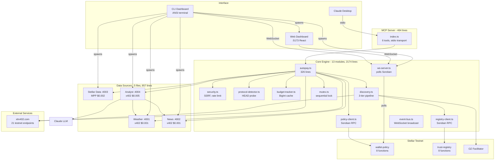
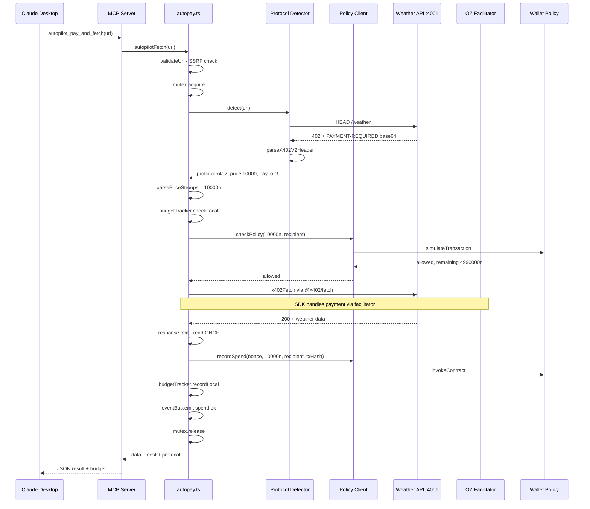
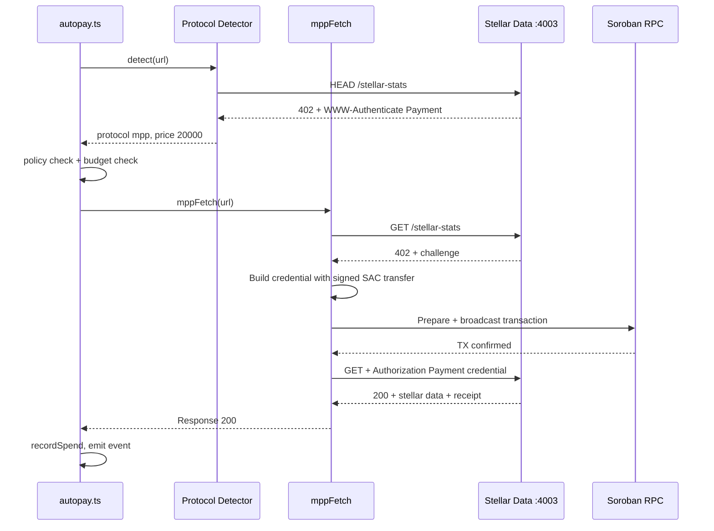
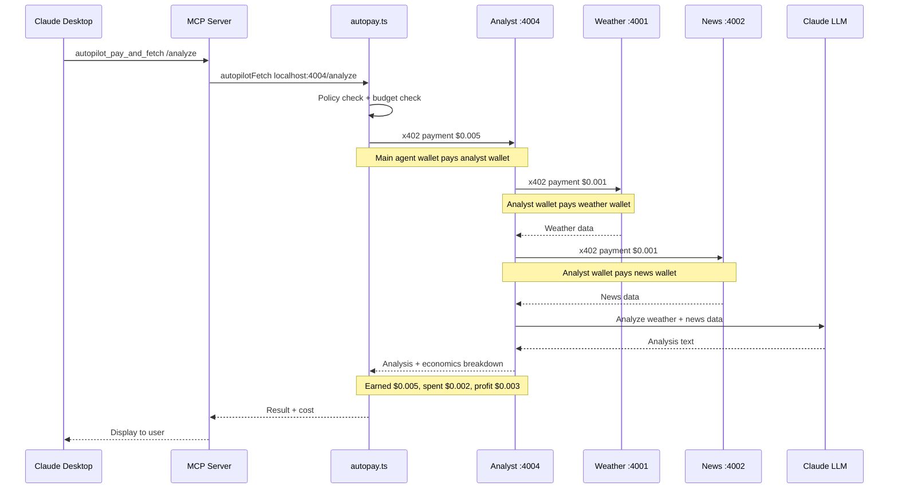
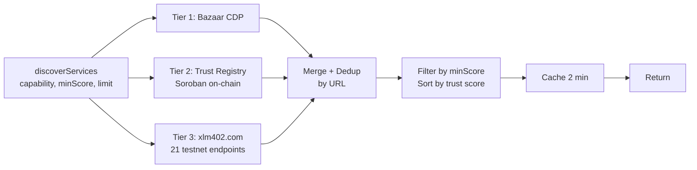
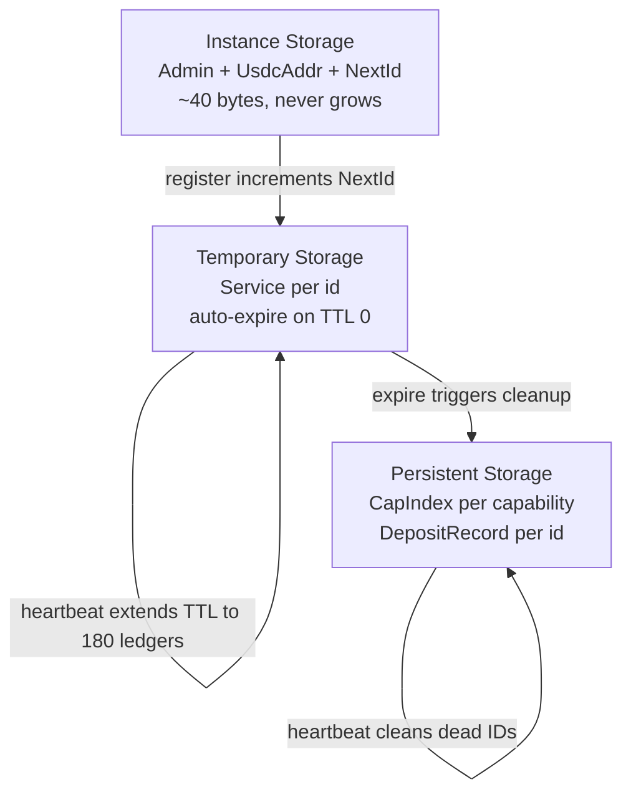
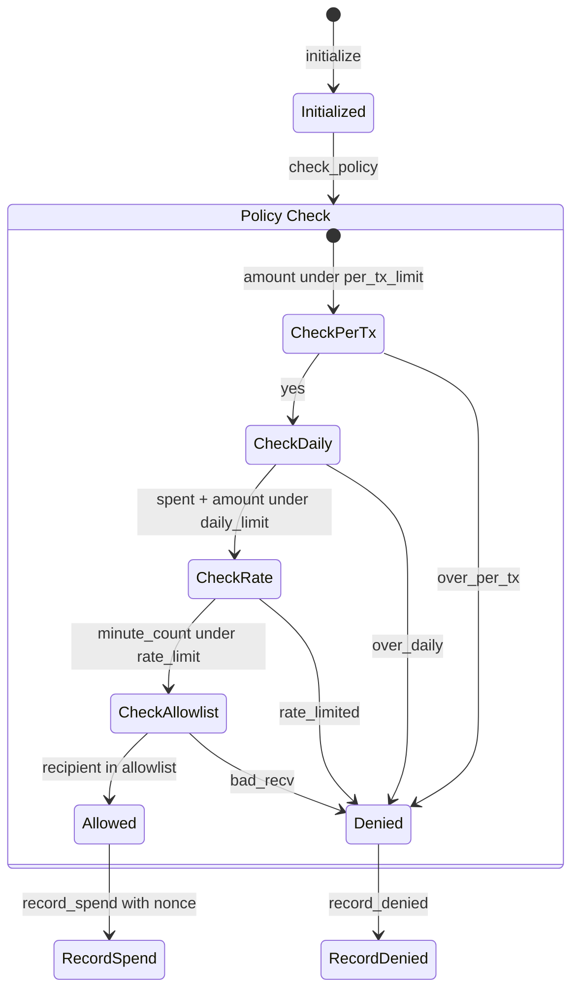

# Architecture

## System overview

x402 Autopilot is an autonomous payment engine for AI agents on Stellar. Claude connects via MCP, discovers paid APIs through a 3-tier pipeline (Bazaar, on-chain trust registry, xlm402.com), pays with USDC micropayments, and tracks spending against on-chain Soroban policy contracts. An analyst agent demonstrates agent-to-agent payments by earning money from the main agent and spending money to buy data from other services. A CLI dashboard manages all processes and shows live status.

## Component diagram



## Payment flow: x402



## Payment flow: MPP charge



## Payment flow: agent-to-agent

The analyst agent earns money from the main agent and spends money to buy data from other services. Three wallets, four transactions.



## Discovery pipeline

Three tiers, deduplicated by URL (registry wins), cached for 2 minutes.



| Tier | Source | Speed | Trust |
|------|--------|-------|-------|
| 1 | x402 Bazaar CDP | Fast HTTP | Default 70 |
| 2 | Soroban Trust Registry | 2-3s simulate | On-chain score |
| 3 | xlm402.com catalog | 1-2s HTTPS | Default 70 |

If any tier is down, the others still work. Discovery degrades but does not fail.

## Trust registry v2 architecture

Services are stored in temporary storage with TTL-based expiry. No manual stale checking needed.



**Storage layout:**
- **Instance:** Admin (Address), UsdcAddr (Address), NextId (u32). Fixed size, never grows.
- **Temporary:** Service(id) maps to ServiceInfo. Auto-expires when TTL reaches 0. Heartbeat extends to 180 ledgers (~15 min).
- **Persistent:** CapIndex(capability) maps to Vec of service IDs. DepositRecord(id) stores owner + amount for refund.

**Registration re-entry:** On restart, shared.ts calls `listServices` before `register_service`. If the previous registration is still alive (TTL > 0), the existing service ID is reused and heartbeat resumes. This avoids the "duplicate URL" panic from the contract.

**Cleanup flows:**
- Graceful shutdown: service calls deregister, removed immediately, deposit refunded.
- Crash: no deregister. TTL counts down. At TTL 0, Soroban deletes the entry. Next heartbeat from a live service in the same capability cleans the dead ID from CapIndex. Deposit reclaimable by owner via reclaim_deposit.

## Wallet policy contract

On-chain source of truth for spending limits. All amounts are i128 (stroops).



**8 functions:**

| Function | Type | Purpose |
|----------|------|---------|
| `initialize` | write | Set owner, daily/per-tx/rate limits |
| `check_policy` | read | Check all limits, return allowed/denied + remaining |
| `record_spend` | write | Record confirmed spend, nonce dedup |
| `record_denied` | write | Increment denied count, emit event |
| `update_policy` | write | Change limits (owner auth) |
| `set_allowlist` | write | Set recipient whitelist (owner auth) |
| `get_today_spending` | read | Current day spend record |
| `get_lifetime_stats` | read | Total spent, tx count, denied count |

## Trust registry contract

**8 functions:**

| Function | Type | Purpose |
|----------|------|---------|
| `initialize` | write | Set admin, USDC SAC address, NextId = 0 |
| `register_service` | write | Collect deposit, assign ID, store in temporary, add to CapIndex |
| `heartbeat` | write | Extend TTL to 180 ledgers, clean dead entries from CapIndex |
| `deregister_service` | write | Remove from temporary + CapIndex, refund deposit |
| `list_services` | read | Scan CapIndex by capability, filter by score, limit results |
| `get_service` | read | Direct lookup by ID from temporary storage |
| `report_quality` | write | Success/fail report, max 1 per reporter per service per day |
| `reclaim_deposit` | write | Reclaim deposit after service TTL expires (crash recovery) |

## CLI dashboard

The CLI dashboard (`scripts/cli-dashboard.ts`, 468 lines) replaces `concurrently` as the process manager. It uses pure ANSI escape codes for rendering (no TUI library dependencies).

**Process management:**
- Spawns 6 processes: ws-server, weather, news, stellar-data, analyst, vite dashboard
- Each child spawned with `detached: true` (process group leader)
- On shutdown, kills entire process groups with `process.kill(-pid, "SIGTERM")`
- On startup, frees ports 4001-4004, 5173-5175, 8080 with `fuser -k`
- Does NOT spawn MCP server (it uses stdio transport for Claude Desktop)

**Terminal rendering:**
- Alternative screen buffer (`\x1b[?1049h` / `\x1b[?1049l`)
- Cursor home + line overwrite each second (no flicker)
- Hidden cursor during render, restored on exit (including crash via uncaughtException)

**Live data:**
- WebSocket client connects to ws-server :8080 for budget events
- Parses `budget:updated` and `spend:ok` events from ws-server's Soroban polling
- Heartbeat timestamps updated from child stdout parsing

**Logging:**
- All child stdout/stderr written to `logs/YYYY-MM-DD_HH-mm-ss.log`
- ANSI codes stripped before parsing, preserved in log file
- Heartbeat lines logged but not printed to terminal (only counter updates)

## File breakdown

```
contracts/
  wallet-policy/src/lib.rs          353 lines, 8 pub fn
  trust-registry/src/lib.rs         426 lines, 8 pub fn

src/                                2174 lines total
  autopay.ts                        326 lines  orchestrator
  policy-client.ts                  316 lines  Soroban RPC for wallet-policy
  discovery.ts                      231 lines  3-tier discovery pipeline
  registry-client.ts                230 lines  Soroban RPC for trust-registry
  protocol-detector.ts              201 lines  HEAD probe, x402 v2 + MPP parsing
  ws-server.ts                      170 lines  WebSocket + Soroban polling
  types.ts                          147 lines  6 error classes, 9 types
  config.ts                         132 lines  env validation, x402 + mppx clients
  security.ts                       117 lines  SSRF prevention, rate limiter
  health-checker.ts                 110 lines  periodic probes
  budget-tracker.ts                  88 lines  BigInt local cache
  event-bus.ts                       65 lines  WebSocket broadcast
  mutex.ts                           41 lines  sequential payment lock

data-sources/src/                   857 lines total
  shared.ts                         346 lines  x402 server, registration, heartbeat
  analyst-api.ts                    284 lines  agent-to-agent
  news-api.ts                        82 lines  x402 paywall
  stellar-data-api.ts                75 lines  MPP paywall
  weather-api.ts                     70 lines  x402 paywall

mcp-server/src/
  index.ts                          464 lines  6 tools, stdio transport

dashboard/src/                      693 lines total
  App.tsx                           543 lines  5 panels, dark theme
  hooks/useWebSocket.ts             140 lines  auto-reconnect, backoff
  main.tsx                            9 lines  React root

scripts/                            897 lines total
  cli-dashboard.ts                  468 lines  ANSI terminal dashboard
  seed-registry.ts                  121 lines  register demo services
  run-demo.ts                       118 lines  full demo flow
  setup-testnet.ts                  104 lines  fund wallet, add USDC trustline
  health-report.ts                   86 lines  CLI health check table
```

## Security model

| Threat | Mitigation | Location |
|--------|-----------|----------|
| SSRF via URL | Block file://, private IPs, localhost unless ALLOW_HTTP | security.ts |
| Overspend via prompt injection | On-chain policy check, allowlist enforcement | wallet-policy |
| Concurrent budget race | Async mutex, one payment at a time | mutex.ts |
| RPC downtime bypass | Fail-closed: RPC unreachable = deny | policy-client.ts |
| Replay attack | Nonce stored on-chain, duplicates rejected | wallet-policy |
| Registry spam | $0.01 USDC deposit required | trust-registry |
| Fake quality reports | Max 1 per reporter per service per day | trust-registry |
| Secret exposure | Private key never exported or logged, masked in errors | config.ts |
| Response body consumed twice | .text() once, JSON.parse separately | autopay.ts |
| HEAD 200 but GET 402 | Re-classify response, fall through to payment | autopay.ts |
| Leftover ports on restart | killPorts frees all service ports on startup | cli-dashboard.ts |

## Dashboard events

Events broadcast via WebSocket from ws-server. BigInt fields serialized to strings.

| Event | Source | Content |
|-------|--------|---------|
| `budget:updated` | ws-server polling | spentToday, remaining, dailyLimit, txCount |
| `spend:ok` | ws-server polling | url, amount, protocol, txHash |

The ws-server polls the wallet-policy Soroban contract every 5 seconds. When spentToday or txCount changes, it broadcasts to all connected WebSocket clients (web dashboard and CLI dashboard).

## Design decisions

**BigInt everywhere for money.** JavaScript Number loses precision above 2^53. USDC has 7 decimal places. 1 USDC = 10,000,000 stroops. BigInt prevents rounding errors. Tradeoff: BigInt is not JSON-serializable, so every JSON.stringify needs a replacer function.

**Fail-closed on RPC failure.** If Soroban RPC is down, checkPolicy returns denied. Allowing payments without policy check would defeat on-chain enforcement.

**Mutex for sequential payments.** Two concurrent autopilotFetch calls could both pass the budget check and overspend. The mutex ensures one-at-a-time. Tradeoff: payments queue up and latency increases linearly.

**Separate fetch wrappers.** x402 SDK wraps globalThis.fetch. mppx SDK also wants to wrap fetch. To prevent conflicts, `Mppx.create({ polyfill: false })` creates a scoped mppFetch. The protocol detector decides which wrapper to use.

**2-minute discovery cache.** Querying Soroban for every discover call takes 2-3 seconds. The cache balances freshness with latency. On payment failure, the specific service is invalidated immediately.

**Temporary storage for services.** Services auto-expire when TTL reaches 0. No manual stale checking. Living services clean dead entries from the capability index during heartbeat. This prevents the instance storage DoS vector (Veridise, Palta Labs).

**Analyst as a real agent.** The analyst has its own wallet, its own x402 client, and makes autonomous economic decisions (which data to buy, how much to spend). The economics breakdown (earned, spent, profit) is visible in every response.

**CLI dashboard over concurrently.** The ANSI dashboard provides a fixed-layout view of all services instead of scrolling log output. Process groups with negative PID kill ensure clean shutdown. Port cleanup on startup handles interrupted previous sessions.

**Registration re-entry.** shared.ts calls listServices before register_service. If the URL is already registered (TTL still alive from a previous session), the existing service ID is reused. This prevents the "duplicate URL" contract panic on restart.
