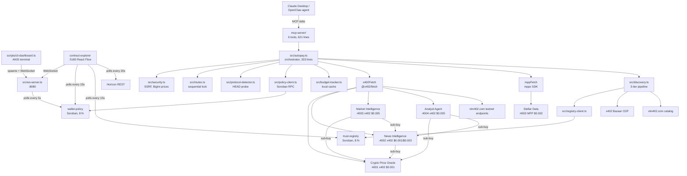

# x402 Autopilot

Autonomous payment engine for AI agents on Stellar. An MCP-enabled agent (Claude Desktop, OpenClaw, anything that speaks Model Context Protocol) discovers paid APIs, pays them in USDC on Stellar testnet, and reads the response. Every spend passes through an on-chain Soroban policy contract before any USDC moves.

## What it does

A user asks Claude "build me a market intelligence report on XLM". Claude calls `autopilot_pay_and_fetch`. The autopay engine HEAD-probes the URL, detects the protocol (x402 or MPP), parses the price from the 402 headers, simulates the wallet-policy contract on Soroban (fail-closed if RPC is down), pays via the appropriate SDK, records the spend on-chain with a nonce, and returns the JSON body to Claude. Some of those endpoints are themselves agents that buy data from other agents before answering, so a single $0.005 request can fan out into three or four real on-chain transfers across distinct wallets.

## Key facts

- 6 paid endpoints across 4 service wallets, plus 1 main wallet that drives them
- 2 Soroban contracts (wallet-policy with 8 functions, trust-registry with 8 functions)
- Dual protocol: x402 (Coinbase) and MPP charge (Stripe), auto-detected via HEAD probe
- 6 MCP tools exposed over stdio for Claude Desktop / OpenClaw integration
- Every payment is a real testnet USDC transfer, verifiable on [stellar.expert](https://stellar.expert/explorer/testnet)
- Live network graph dashboard (React Flow + Zustand, 48 source files)
- Zero-dependency CLI dashboard for terminal use
- Background market monitor in the Market Intelligence agent that buys fresh prices every 90 seconds without human intervention

## Architecture



## How it works

1. The agent calls `autopilot_pay_and_fetch(url)` over MCP stdio
2. `validateUrl` blocks SSRF (file://, private IPs, localhost unless `ALLOW_HTTP=true`)
3. The mutex acquires a 30-second lease so no two payments race the policy check
4. `protocol-detector.detect(url)` HEAD-probes the endpoint with a 5-second timeout. The 402 response decides x402 vs MPP. Status 200 means free
5. The price is parsed into BigInt stroops immediately (`parsePriceStroops`). 1 USDC = 10,000,000 stroops
6. `policy-client.checkPolicy` simulates `wallet-policy::check_policy` on Soroban. If the RPC is unreachable, `checkPolicy` returns `{ allowed: false, reason: "rpc_unavailable" }`. Fail-closed
7. If allowed, the engine pays via `x402Fetch` (Coinbase x402 + OZ facilitator) or `mppFetch` (mppx SDK + Stellar charge)
8. The response body is read once with `.text()`, then `JSON.parse` is wrapped in try/catch
9. The TX hash is extracted from headers, a 32-char nonce is built, and `record_spend(nonce, amount, recipient, txHash)` lands on-chain with retry (1s/2s/4s backoff). The contract panics on duplicate nonces
10. The local budget cache and the dashboard event bus are updated, the mutex releases, and the result returns

If the payment settled but the API errored after, `recordSpend` runs anyway. Money already moved on-chain, so the policy contract has to know.

## Quick start: developer setup

This path runs the four local agents, the wallet-policy contract, the WS server, and the Vite dashboard. Requires a funded testnet wallet.

```bash
# 1. Clone and install (legacy peer deps because @x402/* is pre-1.0)
git clone https://github.com/Andy00L/stelos.git
cd stelos
npm install --legacy-peer-deps

# 2. Copy the env template
cp .env.example .env

# 3. Generate a Stellar testnet keypair
stellar keys generate agent --network testnet
stellar keys address agent       # copy as STELLAR_PUBLIC_KEY
stellar keys reveal agent        # copy as STELLAR_PRIVATE_KEY

# 4. Fund via Friendbot
curl "https://friendbot.stellar.org?addr=$(stellar keys address agent)"

# 5. Get testnet USDC from Circle's faucet
#    https://faucet.circle.com  (select Stellar)

# 6. Get an OpenZeppelin facilitator API key
#    https://channels.openzeppelin.com/testnet/gen

# 7. Deploy your own wallet-policy contract
npm run deploy:wallet-policy
#    Copy the printed contract ID into .env as WALLET_POLICY_CONTRACT_ID

# 8. (Optional) Set up a dedicated analyst keypair
stellar keys generate analyst --network testnet
curl "https://friendbot.stellar.org?addr=$(stellar keys address analyst)"
#    Add USDC trustline, send some USDC from main wallet
#    Copy ANALYST_PRIVATE_KEY and ANALYST_PUBLIC_KEY into .env

# 9. Fill in the .env values you copied above. The trust-registry and
#    USDC SAC contract IDs are pre-filled. The three service wallet env
#    vars (WEATHER_API_*, NEWS_API_*, STELLAR_DATA_API_*) can stay empty:
#    `npm run dev` auto-generates and funds them on first start.

# 10. Start everything (predev hook auto-provisions service wallets)
npm run dev

# 11. Configure Claude Desktop MCP (see "MCP configuration" below)
```

## Quick start: community user (MCP only)

No local agents. Discover and pay external services that other developers registered on the shared trust-registry, plus xlm402.com testnet endpoints.

```bash
# 1. Clone and install
git clone https://github.com/Andy00L/stelos.git
cd stelos
npm install --legacy-peer-deps

# 2. Copy and edit .env
cp .env.example .env

# 3. Generate your own keypair, fund it, get testnet USDC
stellar keys generate myagent --network testnet
curl "https://friendbot.stellar.org?addr=$(stellar keys address myagent)"
# https://faucet.circle.com (select Stellar)

# 4. Get an OZ API key from https://channels.openzeppelin.com/testnet/gen

# 5. Deploy YOUR wallet-policy
npm run deploy:wallet-policy

# 6. Fill .env with STELLAR_PRIVATE_KEY, STELLAR_PUBLIC_KEY, OZ_API_KEY,
#    and the contract ID from step 5. The trust-registry and USDC SAC IDs
#    are pre-filled.

# 7. Start the MCP server only (no local APIs)
npx tsx mcp-server/src/index.ts

# 8. Configure Claude Desktop MCP, then ask:
#    "Discover services with capability blockchain"
#    "Fetch https://xlm402.com/testnet/weather/current?latitude=48.85&longitude=2.35"
```

The trust-registry is a shared on-chain directory. When any developer registers a local service, every other user discovers it (until the TTL expires). When a service crashes its TTL runs out and it disappears automatically.

**Why two setup paths?** The wallet-policy contract uses `owner.require_auth()` for `record_spend`, `record_denied`, `update_policy`, and `set_allowlist`. Only the deployer's key can authorize spending writes against their policy, so each user must deploy their own. The trust-registry contract is shared because reads and writes are not gated to a single owner.

## CLI dashboard

`npm run dev` launches `scripts/cli-dashboard.ts` (472 lines, zero new dependencies). It replaces the noisy `concurrently` output with a fixed-layout ANSI terminal display that updates every second:

- Service status: green/yellow/red dots, port, protocol, price, heartbeat counter
- Live budget: progress bar, spent vs limit, transaction count (sourced from ws-server's WebSocket events)
- Last transaction: service name, USDC cost, time ago
- All verbose stdout goes to a timestamped log file in `logs/YYYY-MM-DD_HH-mm-ss.log`

Press `q` or Ctrl+C to quit. The dashboard kills entire process groups (negative PID signal), runs `fuser -k` on all known ports, restores the cursor, and exits the alternative screen buffer. On startup it does the same port cleanup so an interrupted previous session does not block ports 4001-4004, 5180, 5181, 5182, 8080.

The MCP server is **not** spawned by the CLI dashboard. It uses stdio transport and is launched by Claude Desktop on demand.

## Web dashboard (contract-explorer)

The contract-explorer is a standalone React Flow network graph that visualizes every wallet, service, and contract in real time. It runs on port 5180. 48 TS/TSX files, 7001 lines, with its own `package.json` outside the npm workspace.

What it shows:

- **Wallet nodes** with USDC balance, revenue/expenses totals, and transaction count (Horizon REST poll every 20s)
- **Service nodes** with protocol, price, trust score, and heartbeat TTL countdown bar (Soroban RPC poll every 15s)
- **Wallet-policy node** with daily limit, spending progress, lifetime denied count
- **Trust-registry node** with services per capability bucket
- **Bullet edges** that animate from sender to receiver on every USDC payment (Horizon payment stream + Soroban events + ws-server relay)
- **Activity feed** with color-coded events: spends, registrations, heartbeats, denials, reclaims

Architecture: 10 Zustand stores, 9 React hooks, 4 node types, 2 edge types, 9 shadcn/ui components. A `PaymentOrchestrator` (1027 lines) initializes outside React at module load and wires every store together so React components never subscribe to external data directly. URL params override the contract IDs and RPC endpoint:

```
http://localhost:5180/?policy=C...&registry=C...&rpc=https://...
```

See [contract-explorer/README.md](contract-explorer/README.md) for the full architecture.

## MCP configuration

Add to your Claude Desktop MCP settings:

```json
{
  "mcpServers": {
    "x402-autopilot": {
      "command": "npx",
      "args": ["tsx", "mcp-server/src/index.ts"],
      "cwd": "/path/to/stelos",
      "env": {
        "STELLAR_PRIVATE_KEY": "S...",
        "STELLAR_PUBLIC_KEY": "G...",
        "WALLET_POLICY_CONTRACT_ID": "C...",
        "TRUST_REGISTRY_CONTRACT_ID": "CAIXHQCJQPJ6AVC4YRRV7RCFCLXIE2SZWLQ4XJUTFKZZQRGGOCTDCSBQ",
        "USDC_SAC_CONTRACT_ID": "CBIELTK6YBZJU5UP2WWQEUCYKLPU6AUNZ2BQ4WWFEIE3USCIHMXQDAMA",
        "OZ_API_KEY": "...",
        "ALLOW_HTTP": "true"
      }
    }
  }
}
```

## MCP tools

| Tool | Description |
|------|-------------|
| `autopilot_pay_and_fetch` | Pay for and fetch any x402 or MPP endpoint. Supports GET (default) and POST/PUT/PATCH/DELETE with a JSON body. Returns the unwrapped data plus payment metadata in `structuredContent`. |
| `autopilot_research` | Discover services by capability, then call `autopilot_pay_and_fetch` against each URL until budget is exhausted. Stops on `PolicyDeniedError`, continues past per-URL fetch errors. |
| `autopilot_check_budget` | Sync from Soroban and return today's spend, remaining budget, daily limit, and lifetime totals. |
| `autopilot_discover` | Run the 3-tier discovery pipeline (Bazaar + trust-registry + xlm402.com) and return services sorted by trust score. Requires a `capability` argument. |
| `autopilot_set_policy` | Call `wallet-policy::update_policy`. Owner authorization required (the engine signs with the configured `STELLAR_PRIVATE_KEY`). |
| `autopilot_registry_status` | Aggregate `list_services` calls across the four built-in capabilities (`weather`, `news`, `blockchain`, `analysis`). |

**Known gap:** `autopilot_registry_status` polls the four built-in capability names hardcoded in `mcp-server/src/index.ts:513`, but the live agent network registers under `crypto_prices`, `news`, `briefing`, `blockchain`, `market_intelligence`, and `analysis`. The contract-explorer dashboard reads the full set via `SEED_CAPABILITIES` in `contract-explorer/src/lib/constants.ts:38`. Use `autopilot_discover` with an explicit capability to query the others.

## OpenClaw integration

The same MCP server powers OpenClaw skills. See [openclaw-skill/](openclaw-skill/) for the skill manifest, MCP config snippet, and install instructions. Once installed, an OpenClaw agent on WhatsApp, Telegram, Discord, Slack, or any other supported channel gets the same six tools as Claude Desktop.

## Services

| Service file | Endpoint | Port | Protocol | Price | Capability | Wallet env |
|--------------|----------|------|----------|-------|------------|-----------|
| `weather-api.ts` (Crypto Price Oracle) | `GET /prices` | 4001 | x402 | $0.001 | `crypto_prices` | `WEATHER_API_*` |
| `news-api.ts` (News) | `GET /news` | 4002 | x402 | $0.001 | `news` | `NEWS_API_*` |
| `news-api.ts` (News Intelligence) | `POST /briefing` | 4002 | x402 | $0.003 | `briefing` | `NEWS_API_*` |
| `stellar-data-api.ts` (Stellar Data) | `GET /stellar-stats` | 4003 | MPP | $0.002 | `blockchain` | `STELLAR_DATA_API_*` |
| `stellar-data-api.ts` (Market Intelligence) | `POST /market-report` | 4003 | x402 | $0.005 | `market_intelligence` | `STELLAR_DATA_API_*` |
| `analyst-api.ts` (Analyst) | `POST /analyze` | 4004 | x402 | $0.005 | `analysis` | `ANALYST_PRIVATE_KEY` / `ANALYST_PUBLIC_KEY` |

The filenames on disk are kept (`weather-api.ts`, `stellar-data-api.ts`) so the env var names and `data-sources/package.json` scripts continue to work, but the content is now the agent network described above. Each file's header comment explains the rename.

The Crypto Price Oracle pulls live data from CoinGecko's free `/simple/price` endpoint with a 5-second timeout and falls back to a hardcoded `FALLBACK_ASSETS` map (tagged `source: "demo-fallback"`) on failure. The other agents serve static data plus an LLM call.

LLM priority for the three agents that produce briefings/reports/analyses (News Intelligence, Market Intelligence, Analyst):
1. `claude -p` headless via `spawn` (uses the local Claude Code OAuth subscription, no API key needed)
2. Anthropic API via `ANTHROPIC_API_KEY` if set
3. Raw merged data fallback (still returns a valid JSON payload, with `llm_mode: "raw_data_fallback"`)

The Market Intelligence agent runs an autonomous monitor on a 90-second interval (after a 30-second warmup) that buys fresh crypto prices and caches them for 120 seconds. The cache absorbs the cost of the prices sub-purchase for any `/market-report` request that lands while the cache is fresh.

## Project structure

```
stelos/
  contracts/
    wallet-policy/src/lib.rs          353 lines, 8 pub fn
    trust-registry/src/lib.rs         426 lines, 8 pub fn
  src/                                12 modules, 1967 lines
    autopay.ts                        333 lines  payment orchestrator
    policy-client.ts                  316 lines  Soroban RPC for wallet-policy
    discovery.ts                      231 lines  3-tier discovery pipeline
    protocol-detector.ts              201 lines  HEAD probe + 402 header parsing
    ws-server.ts                      197 lines  WebSocket + 5s Soroban polling + MCP relay
    types.ts                          136 lines  6 error classes + type definitions
    config.ts                         132 lines  env validation + x402/mppx clients
    registry-client.ts                120 lines  Soroban RPC for trust-registry
    security.ts                       107 lines  SSRF prevention + price parser
    budget-tracker.ts                  88 lines  BigInt local cache
    event-bus.ts                       65 lines  WebSocket broadcast + bigint serializer
    mutex.ts                           41 lines  sequential payment lock
  data-sources/src/                   5 files, 2413 lines
    stellar-data-api.ts               620 lines  MPP /stellar-stats + x402 /market-report + monitor
    analyst-api.ts                    544 lines  x402 /analyze, agent-to-agent + LLM
    shared.ts                         532 lines  x402 server, registration, heartbeat, deregister
    news-api.ts                       502 lines  x402 /news + /briefing + LLM
    weather-api.ts                    215 lines  x402 /prices, CoinGecko upstream
  mcp-server/src/index.ts             621 lines  6 tools, stdio transport, ws relay
  contract-explorer/src/              48 files, 7001 lines
    stores/  (10 files)              2947 lines  Zustand stores + payment-orchestrator (1027)
    hooks/   (9 files)                860 lines  React hooks (use-graph-layout: 592)
    components/ (12 + 9 ui files)    2090 lines  nodes, edges, layout, shadcn/ui
    lib/ (5 files)                   1024 lines  Soroban RPC, types, constants, Horizon
    app.tsx + main.tsx + types         80 lines  React shell
  scripts/                            7 TS + 2 bash, 1584 TS lines
    setup-service-wallets.ts          534 lines  generate, fund, trustline, USDC, allowlist
    cli-dashboard.ts                  472 lines  ANSI terminal dashboard
    ensure-service-wallets.ts         149 lines  predev fast-path
    seed-registry.ts                  121 lines  manual capability registration
    run-demo.ts                       118 lines  full demo flow
    setup-testnet.ts                  104 lines  fund main wallet, add USDC trustline
    health-report.ts                   86 lines  CLI health probe
    deploy-wallet-policy.sh                      build + deploy + initialize
    deploy-trust-registry.sh                     build + deploy + initialize
```

## Tech stack

| Component | Technology | Version |
|-----------|-----------|---------|
| Smart contracts | Soroban (Rust) | soroban-sdk 22.0.0 |
| Core engine | TypeScript | ^5.4.0 |
| x402 client | @x402/fetch + @x402/stellar | latest (pre-1.0) |
| x402 server | @x402/express | latest (pre-1.0) |
| MPP client | mppx + @stellar/mpp | latest (pre-1.0) |
| MPP server | mppx/express + @stellar/mpp/charge/server | latest (pre-1.0) |
| Stellar SDK | @stellar/stellar-sdk | ^14.5.0 |
| MCP SDK | @modelcontextprotocol/sdk | ^1.0.0 |
| Web framework (data-sources) | Express | ^4.21.0 |
| WebSocket | ws | ^8.18.0 |
| Web dashboard | React + Vite + @xyflow/react | 19.0 / 6.1 / 12.10 |
| State management | Zustand | ^5.0.12 |
| UI library | shadcn/ui (Radix) + Tailwind CSS | 3.4 |
| CLI dashboard | Node built-ins + ws | zero new deps |
| Network | Stellar testnet | soroban-testnet.stellar.org |

## Contracts on testnet

| Contract | Ownership | How to get one |
|----------|-----------|----------------|
| wallet-policy | Per user (owner auth on every write) | `npm run deploy:wallet-policy` |
| trust-registry | Shared, anyone reads/registers | Pre-deployed: `CAIXHQCJQPJ6AVC4YRRV7RCFCLXIE2SZWLQ4XJUTFKZZQRGGOCTDCSBQ` |
| USDC SAC | Stellar system contract | `CBIELTK6YBZJU5UP2WWQEUCYKLPU6AUNZ2BQ4WWFEIE3USCIHMXQDAMA` |

The trust-registry initialization takes `(admin, usdc_addr)`. The deploy script (`scripts/deploy-trust-registry.sh`) wires both. The wallet-policy initialization takes `(owner, daily_limit, per_tx_limit, rate_limit)`. Defaults baked into the code (`src/config.ts`): $0.50/day (5,000,000 stroops), $0.01/tx (100,000 stroops), 20 req/min. The `.env.example` template ships with a more permissive set ($0.10/tx, 60 req/min) so demos do not bump into rate limits.

## Environment variables

The full list lives in [.env.example](.env.example). Required vs optional:

| Variable | Required? | Default | Description |
|----------|-----------|---------|-------------|
| `STELLAR_PRIVATE_KEY` | yes | none | Main agent secret key (S...) |
| `STELLAR_PUBLIC_KEY` | yes | none | Main agent public key (G...). Must match the private key, validated at startup |
| `WALLET_POLICY_CONTRACT_ID` | yes | none | Your deployed wallet-policy contract |
| `TRUST_REGISTRY_CONTRACT_ID` | yes | pre-filled | Shared on-chain trust registry |
| `USDC_SAC_CONTRACT_ID` | yes | pre-filled | Stellar Asset Contract for USDC |
| `OZ_API_KEY` | yes | none | OpenZeppelin facilitator key for x402 |
| `WEATHER_API_WALLET` / `_SECRET` | yes (sellers) | auto | Crypto Price Oracle wallet, generated by `npm run dev` |
| `NEWS_API_WALLET` / `_SECRET` | yes (sellers) | auto | News + News Intelligence wallet |
| `STELLAR_DATA_API_WALLET` / `_SECRET` | yes (sellers) | auto | Stellar Data + Market Intelligence wallet |
| `ANALYST_PRIVATE_KEY` / `ANALYST_PUBLIC_KEY` | yes (analyst) | none | Analyst keypair, separate from main wallet |
| `STELLAR_NETWORK` | no | `stellar:testnet` | Network selector for x402/MPP signers |
| `SOROBAN_RPC_URL` | no | `https://soroban-testnet.stellar.org` | Soroban RPC endpoint |
| `HORIZON_URL` | no | `https://horizon-testnet.stellar.org` | Horizon REST endpoint |
| `NETWORK_PASSPHRASE` | no | `Test SDF Network ; September 2015` | Network passphrase for tx signing |
| `USDC_ISSUER` | no | `GBBD47IF6LWK7P7MDEVSCWR7DPUWV3NY3DTQEVFL4NAT4AQH3ZLLFLA5` | USDC issuer address |
| `OZ_FACILITATOR_URL` | no | `https://channels.openzeppelin.com/x402/testnet` | x402 facilitator endpoint |
| `DEFAULT_DAILY_LIMIT` | no | code: `5000000`; .env.example: `5000000` | Stroops per day ($0.50) |
| `DEFAULT_PER_TX_LIMIT` | no | code: `100000`; .env.example: `1000000` | Stroops per tx ($0.01 vs $0.10) |
| `DEFAULT_RATE_LIMIT` | no | code: `20`; .env.example: `60` | Requests per minute |
| `ALLOW_HTTP` | dev only | `false` | Set `true` to allow `http://` and localhost URLs |
| `WS_PORT` | no | `8080` | ws-server port |
| `MCP_SERVER_PORT` | no | `3000` | Reserved (MCP uses stdio, port unused) |
| `PORT_WEATHER_API` | no | `4001` | Crypto Price Oracle port |
| `PORT_NEWS_API` | no | `4002` | News Intelligence port |
| `PORT_STELLAR_DATA_API` | no | `4003` | Market Intelligence port |
| `PORT_ANALYST_API` | no | `4004` | Analyst port |
| `MPP_SECRET_KEY` | yes (MPP) | demo value | HMAC key for MPP charge server |
| `ANTHROPIC_API_KEY` | optional | none | LLM fallback when `claude -p` is unavailable |
| `ANALYST_CLAUDE_MODEL` | no | `claude-sonnet-4-6` | Model for `claude -p` in analyst-api.ts |
| `NEWS_CLAUDE_MODEL` | no | `claude-sonnet-4-6` | Model for `claude -p` in news-api.ts |
| `MARKET_CLAUDE_MODEL` | no | `claude-sonnet-4-6` | Model for `claude -p` in stellar-data-api.ts |

## Edge cases handled

| # | Edge case | Solution | Where |
|---|-----------|----------|-------|
| 1 | Float precision for money | BigInt stroops everywhere | `src/types.ts`, `src/budget-tracker.ts` |
| 2 | Payment OK but API errored | `recordSpend` runs in catch, money is gone | `src/autopay.ts:186` |
| 3 | Two payments race the policy check | 30s async mutex | `src/mutex.ts` |
| 4 | Soroban RPC unreachable on `check_policy` | Fail-closed, return `rpc_unavailable` | `src/policy-client.ts:202` |
| 5 | RPC timeout on `record_spend` | Retry 3x with 1s/2s/4s backoff | `src/policy-client.ts:169` |
| 6 | HEAD probe timeout | 5s timeout, retry once | `src/protocol-detector.ts:14` |
| 7 | SSRF via URL | Block file://, private IPs, localhost unless `ALLOW_HTTP` | `src/security.ts:38` |
| 8 | Prompt injection spend ("send to GATTACKER") | On-chain allowlist enforced by `check_policy` | `contracts/wallet-policy/src/lib.rs:158` |
| 9 | Duplicate `record_spend` from RPC retry | Nonce stored on-chain, contract panics on duplicate | `contracts/wallet-policy/src/lib.rs:197` |
| 10 | Spam registrations | $0.01 USDC deposit collected via SAC transfer | `contracts/trust-registry/src/lib.rs:97` |
| 11 | Service crashed without deregister | TTL counts down (60 ledgers initial, 180 after heartbeat); entry auto-expires | `contracts/trust-registry/src/lib.rs:181` |
| 12 | Crashed deposit recovery | `reclaim_deposit(service_id, owner)` after TTL expires | `contracts/trust-registry/src/lib.rs:378` |
| 13 | Duplicate URL within capability | Rejected with panic at register | `contracts/trust-registry/src/lib.rs:120` |
| 14 | Restart within TTL window | `shared.ts:resolveServiceId` lists first, reuses existing ID, resumes heartbeat | `data-sources/src/shared.ts:227` |
| 15 | HEAD returns 200 but GET returns 402 | `autopay.ts:classifyFreeAs402` re-detects from response headers | `src/autopay.ts:283` |
| 16 | Response body read twice | `.text()` once, then `JSON.parse` separately | `src/autopay.ts:138` |
| 17 | Body already consumed across re-classify | Reuse the same Response object | `src/autopay.ts:78` |
| 18 | Leftover ports from previous run | `killPorts()` runs `fuser -k` on startup | `scripts/cli-dashboard.ts:97` |
| 19 | Child processes survive parent exit | `detached: true` + `process.kill(-pid)` on shutdown | `scripts/cli-dashboard.ts:163` |
| 20 | `claude -p` subprocess hangs on stdin | Explicit `proc.stdin.write(prompt); proc.stdin.end()` | `data-sources/src/analyst-api.ts:104` |
| 21 | xlm402.com discovery tier down | Try/catch around `fetchXlm402Catalog`, return empty array | `src/discovery.ts:131` |
| 22 | Bazaar discovery tier down | Try/catch around `bazaarClient.extensions.discovery.listResources` | `src/discovery.ts:170` |
| 23 | Trust-registry RPC down during discovery | Try/catch around `registryClient.listServices` | `src/discovery.ts:177` |
| 24 | Client disconnects during long LLM call | `req.on("close")` flag + `req.socket.destroyed` check before `res.json` | `data-sources/src/analyst-api.ts:307` |

## What makes this different

Most x402 demos boil down to one fetch call with a hardcoded URL. This project goes further:

- **On-chain spending policy.** The Soroban contract is the source of truth, not a local check. A bug in the engine cannot overspend if the contract says no.
- **Dual protocol.** x402 and MPP charge coexist on the same engine, auto-detected via HEAD probe.
- **3-tier discovery.** Bazaar CDP + on-chain trust-registry + xlm402.com catalog. Any tier can be down without breaking the others.
- **Agent-to-agent payments.** Three of the four built-in agents earn money from external requests and spend their own USDC to buy raw data from other agents. Profit and loss are reported in every response under `economics`.
- **Anti-spam deposits.** $0.01 USDC required to register, refunded on graceful deregister, reclaimable after TTL expiry.
- **Fail-closed security.** If Soroban RPC is unreachable, payment is denied. No "log and continue" fallback.
- **Real external payments.** The xlm402.com tier sends USDC to wallets we do not control, visible on stellar.expert.
- **Live network graph.** React Flow dashboard with bullet-edge animations, Horizon + Soroban polling, 10 Zustand stores wired by an out-of-React orchestrator.
- **CLI dashboard.** Zero new dependencies, fixed-layout ANSI display with WebSocket-driven budget panel.

**Tradeoffs.** Soroban testnet writes take 5 to 15 seconds. The mutex serializes all payments through a single lease, so concurrent requests queue up linearly. Each seller service gets its own distinct wallet (auto-provisioned on first run), which means every payment is a real transfer that costs a network fee. The `claude -p` headless mode can conflict with an active Claude Code session sharing the same OAuth keychain. Heartbeats fire every 4 minutes per service, which means each service writes to Soroban roughly 360 times per 24 hours and burns network fee XLM.

## Documentation

- [ARCHITECTURE.md](ARCHITECTURE.md) - system design, payment flows, contract internals, security model
- [contract-explorer/README.md](contract-explorer/README.md) - web dashboard architecture, stores, hooks, polling intervals
- [openclaw-skill/README.md](openclaw-skill/README.md) - OpenClaw install paths and MCP config
- [openclaw-skill/SKILL.md](openclaw-skill/SKILL.md) - OpenClaw skill manifest and tool reference
- [skill/SKILL.md](skill/SKILL.md) - original short skill definition
- [.env.example](.env.example) - every environment variable with defaults

## License

MIT. See [LICENSE](LICENSE).
