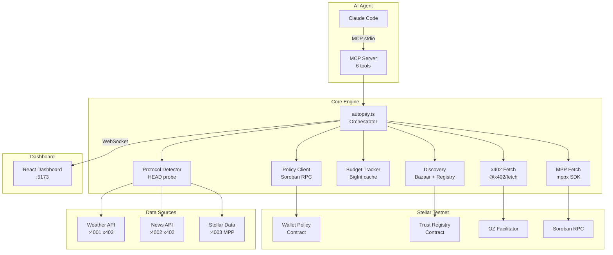

# x402 Autopilot

Smart agent wallet for Stellar. An MCP-enabled AI agent autonomously discovers paid APIs, pays for them with USDC on Stellar testnet, and receives data. All spending is enforced by an on-chain Soroban policy contract. Supports both x402 and MPP charge protocols with automatic detection.

[DEMO VIDEO](VIDEO_URL)

## What it does

Claude Code connects to the autopilot MCP server and gets 6 tools. It discovers paid APIs via x402 Bazaar and an on-chain trust registry, pays for data with USDC micropayments, and tracks spending against on-chain limits. Two Soroban contracts (15 functions total) enforce daily budgets, per-transaction caps, rate limits, and recipient allowlists. The agent cannot overspend even if prompted to.

The system handles both the x402 protocol (Coinbase/OZ) and the MPP charge protocol (Stellar/Stripe). A HEAD probe detects which protocol an endpoint uses, then routes to the correct payment flow. Three demo data sources are included: weather and news (x402) and Stellar network stats (MPP charge).

## Architecture



## How it works

1. Agent calls `autopilot_pay_and_fetch(url)` via MCP
2. HEAD probe detects protocol (x402 or MPP) and price from 402 headers
3. On-chain policy check via Soroban (fail-closed: RPC down = payment denied)
4. Payment executes: x402 via OZ facilitator, MPP via mppx SDK (handles full 402 challenge/credential cycle)
5. Spend recorded on-chain with nonce dedup, budget updated, quality reported

## Quick start

```bash
# 1. Install
git clone <repo> && cd x402-autopilot
npm install --legacy-peer-deps

# 2. Copy env template
cp .env.example .env

# 3. Generate a Stellar testnet keypair
stellar keys generate agent --network testnet
stellar keys address agent    # copy as STELLAR_PUBLIC_KEY
stellar keys show agent       # copy as STELLAR_PRIVATE_KEY

# 4. Fund via Friendbot
curl "https://friendbot.stellar.org?addr=$(stellar keys address agent)"

# 5. Get testnet USDC
#    Go to https://faucet.circle.com, select Stellar, paste your public key

# 6. Get OZ API key
#    Go to https://channels.openzeppelin.com/testnet/gen, copy the key

# 7. Deploy your wallet-policy contract (you need your own, see note below)
npm run deploy:wallet-policy
#    Copy the contract ID from the output into .env

# 8. Fill in .env: STELLAR_PRIVATE_KEY, STELLAR_PUBLIC_KEY, OZ_API_KEY,
#    WALLET_POLICY_CONTRACT_ID (from step 7).
#    Set all 3 API wallets to your public key for the demo.
#    The trust-registry and USDC SAC IDs are pre-filled.

# 9. Start everything
npm run dev
```

**Why you need your own wallet-policy:** The wallet-policy contract uses owner auth for spending operations (record_spend, update_policy, set_allowlist). Only the deployer's key can call these. The trust-registry is shared and public: anyone can register services, report quality, and read.

## MCP configuration

Add to your Claude Code MCP settings:

```json
{
  "mcpServers": {
    "x402-autopilot": {
      "command": "npx",
      "args": ["tsx", "mcp-server/src/index.ts"],
      "cwd": "/path/to/x402-autopilot",
      "env": {
        "STELLAR_PRIVATE_KEY": "S...",
        "STELLAR_PUBLIC_KEY": "G...",
        "WALLET_POLICY_CONTRACT_ID": "C...",
        "TRUST_REGISTRY_CONTRACT_ID": "C...",
        "USDC_SAC_CONTRACT_ID": "C...",
        "OZ_API_KEY": "...",
        "ALLOW_HTTP": "true"
      }
    }
  }
}
```

Then ask Claude: "Use autopilot to fetch weather data from http://localhost:4001/weather"

## MCP tools

| Tool | Description |
|------|-------------|
| `autopilot_pay_and_fetch` | Pay for and fetch data from any x402/MPP endpoint |
| `autopilot_research` | Auto-discover services by topic, fetch from multiple sources |
| `autopilot_check_budget` | Read on-chain spending status (Soroban source of truth) |
| `autopilot_discover` | List available paid APIs from Bazaar + trust registry |
| `autopilot_set_policy` | Update on-chain spending limits (owner auth required) |
| `autopilot_registry_status` | Service registry overview with health counts |

## Project structure

```
x402-autopilot/
  contracts/
    wallet-policy/     8 functions, 353 lines: budget enforcement, nonce dedup
    trust-registry/    7 functions: service directory, trust scoring, TTL auto-expire
  src/                 12 modules, 1831 lines: core TypeScript engine
  data-sources/        3 Express servers: weather, news, stellar-data
  mcp-server/          6 MCP tools, 464 lines
  dashboard/           React + Vite + WebSocket, 5 panels
  scripts/             6 scripts: setup, deploy, seed, demo, health
```

## Tech stack

| Component | Technology | Version |
|-----------|-----------|---------|
| Smart contracts | Soroban (Rust) | soroban-sdk 22.0.0 |
| Core engine | TypeScript | 5.4+ |
| x402 client | @x402/fetch + @x402/stellar | latest |
| x402 server | @x402/express + OZ facilitator | latest |
| MPP client | mppx SDK (polyfill: false) | latest |
| MPP server | mppx/express + @stellar/mpp | latest |
| Stellar SDK | @stellar/stellar-sdk | ^14.5.0 |
| MCP server | @modelcontextprotocol/sdk | ^1.0.0 |
| Data sources | Express | ^4.21.0 |
| Dashboard | React + Vite | 18.3 / 5.4 |
| Network | Stellar testnet | soroban-testnet.stellar.org |

## Edge cases handled

| # | Edge case | Solution | Where |
|---|-----------|----------|-------|
| 1 | Float precision for money | BigInt stroops everywhere (1 USDC = 10,000,000) | types.ts, budget-tracker.ts |
| 2 | Payment OK but API error | record_spend anyway (money is gone) | autopay.ts catch block |
| 3 | Two payments race | Async mutex, one payment at a time | mutex.ts |
| 4 | Soroban RPC down | FAIL CLOSED, deny payment | policy-client.ts |
| 5 | RPC timeout on record_spend | Retry 3x with 1s/2s/4s backoff | policy-client.ts |
| 6 | HEAD probe timeout | 5s timeout, retry once | protocol-detector.ts |
| 7 | SSRF via URL | Block file://, private IPs, localhost | security.ts |
| 8 | Prompt injection spend | On-chain allowlist rejects unknown recipients | wallet-policy contract |
| 9 | Duplicate record_spend | Nonce stored on-chain, rejects duplicates | wallet-policy contract |
| 10 | Day rollover | day_key = timestamp/86400, fresh record each day | wallet-policy contract |
| 11 | Spam registrations | $0.01 USDC deposit required | trust-registry contract |
| 12 | Service goes down silently | TTL auto-expire + heartbeat cleanup of CapIndex | trust-registry contract |
| 13 | Response body read twice | .text() once, JSON.parse separately | autopay.ts |
| 14 | WebSocket disconnect | Auto-reconnect 1s-30s exponential backoff | useWebSocket.ts |
| 15 | Nonce exceeds Symbol limit | Truncated to 32 chars for Soroban | autopay.ts |
| 16 | x402 v2 PAYMENT-REQUIRED | Base64 header decoded, price + payTo extracted | protocol-detector.ts |

## Hackathon tags (9/9)

| Tag | Integration |
|-----|-------------|
| x402 | Client: @x402/fetch + @x402/stellar. Server: @x402/express + OZ facilitator. Bazaar: @x402/extensions. 2 paywalled APIs (weather, news). |
| MPP | Client: mppx SDK (Mppx.create, polyfill: false). Server: mppx/express + @stellar/mpp/charge. 1 paywalled API (stellar-data). Auto-detected by protocol detector. |
| Stellar | USDC testnet, 2 Soroban contracts, Horizon balance checks, Friendbot setup. |
| Soroban | Wallet policy (8 functions) + Trust registry (7 functions). soroban-sdk 22.0.0. |
| Claude | MCP server with 6 tools via @modelcontextprotocol/sdk. Claude Code as primary interface. |
| Agents | Financially autonomous agent. Discovers, pays, receives data without human input. |
| AI | Claude reasons about budget, source quality, risk. Chooses services by trust score. |
| OpenClaw | SKILL.md in /skill/. Compatible with Telegram/Discord/Slack bots. |
| Crypto | USDC micropayments on Stellar. BigInt stroops. On-chain audit trail via contract events. |

## What makes this different

Most x402 demos show a single fetch call with a hardcoded URL. This project adds:

- On-chain spending policy (not just a local check, the Soroban contract is the source of truth)
- Dual protocol support (x402 and MPP charge, auto-detected via HEAD probe)
- Trust-scored service discovery (Bazaar + on-chain registry, sorted by quality reports)
- Anti-spam deposits ($0.01 USDC to register a service, refunded on deregister)
- Nonce-based idempotency (contract rejects duplicate spend records)
- Fail-closed security (if Soroban RPC is down, payment is denied, not allowed)
- Real-time dashboard (WebSocket, 5 panels, live spend tracking)

Tradeoffs: testnet Soroban transactions take 5-15 seconds to confirm. The mutex serializes payments, so concurrent requests queue up. In the demo setup, all three API wallets use the same address as the agent wallet, so USDC transfers are self-transfers with zero net balance change. A production setup would use separate seller wallets.

## Future work

- MPP session/channel mode (persistent payment channels, lower per-call cost)
- Mainnet deployment (real USDC, production facilitator)
- Multi-chain support (EVM chains via x402, Stellar via MPP)
- Agent-to-agent payments (one autopilot pays another autopilot's API)

## Contracts on testnet

Each user deploys their own **wallet-policy** (spending limits are personal). The **trust-registry** is shared (a public service directory).

| Contract | Ownership | Deploy |
|----------|-----------|--------|
| wallet-policy | Per-user (owner auth on spend/policy) | `npm run deploy:wallet-policy` (required) |
| trust-registry | Shared (anyone reads/registers) | Pre-deployed: `CAIXHQCJQPJ6AVC4YRRV7RCFCLXIE2SZWLQ4XJUTFKZZQRGGOCTDCSBQ` |
| USDC SAC | Stellar system contract | `CBIELTK6YBZJU5UP2WWQEUCYKLPU6AUNZ2BQ4WWFEIE3USCIHMXQDAMA` |

To deploy your own trust-registry (optional): `npm run deploy:trust-registry`

## Documentation

- [ARCHITECTURE.md](ARCHITECTURE.md) - System design, data flows, contract details
- [skill/SKILL.md](skill/SKILL.md) - OpenClaw skill definition

## License

MIT
