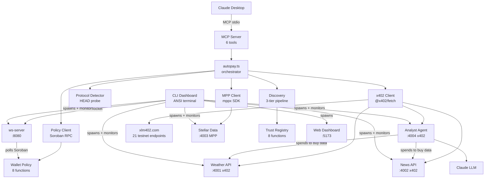

# x402 Autopilot

Smart agent wallet for Stellar. An MCP-enabled AI agent autonomously discovers paid APIs, negotiates x402/MPP payments with USDC on Stellar testnet, and receives data. All spending is enforced by an on-chain Soroban policy contract.

[DEMO VIDEO](VIDEO_URL)

## What it does

Claude connects to the autopilot MCP server and gets 6 tools. It discovers paid APIs from three sources (x402 Bazaar, an on-chain trust registry, and the xlm402.com public catalog), pays with USDC micropayments, and tracks spending against on-chain limits. Two Soroban contracts (16 functions total) enforce daily budgets, per-transaction caps, rate limits, and recipient allowlists. The agent cannot overspend even if prompted to.

The system supports both the x402 protocol (Coinbase/OZ) and the MPP charge protocol (Stellar/Stripe), auto-detected via HEAD probe. An analyst agent earns money by selling analyses and spends money to buy raw data from other services, creating a real agent-to-agent payment chain visible on-chain.

## Architecture



## How it works

1. Agent calls `autopilot_pay_and_fetch(url)` via MCP
2. HEAD probe detects protocol (x402 or MPP) and price from 402 headers
3. On-chain policy check via Soroban (fail-closed: RPC down = payment denied)
4. Payment executes: x402 via facilitator, MPP via mppx SDK
5. Spend recorded on-chain with nonce dedup, budget updated, quality reported

## Quick start: Developer setup

Run the full demo with 4 local APIs + external services.

```bash
# 1. Clone and install
git clone https://github.com/Andy00L/stelos.git
cd stelos
npm install --legacy-peer-deps

# 2. Copy env template
cp .env.example .env

# 3. Generate a Stellar testnet keypair
stellar keys generate agent --network testnet
stellar keys address agent    # copy as STELLAR_PUBLIC_KEY
stellar keys show agent       # copy as STELLAR_PRIVATE_KEY

# 4. Fund via Friendbot
curl "https://friendbot.stellar.org?addr=$(stellar keys address agent)"

# 5. Get testnet USDC
#    Go to https://faucet.circle.com, select Stellar, paste your public key

# 6. Get OZ API key
#    Go to https://channels.openzeppelin.com/testnet/gen, copy the key

# 7. Deploy your wallet-policy contract
npm run deploy:wallet-policy
#    Copy the contract ID into .env as WALLET_POLICY_CONTRACT_ID

# 8. (Optional) Setup analyst agent for agent-to-agent demo
stellar keys generate analyst --network testnet
curl "https://friendbot.stellar.org?addr=$(stellar keys address analyst)"
#    Add USDC trustline, send USDC from main wallet
#    Copy ANALYST_PRIVATE_KEY and ANALYST_PUBLIC_KEY to .env

# 9. Fill remaining .env values:
#    STELLAR_PRIVATE_KEY, STELLAR_PUBLIC_KEY, OZ_API_KEY
#    Set all 3 API wallets to your public key for the demo
#    Trust-registry and USDC SAC IDs are pre-filled

# 10. Start everything
npm run dev

# 11. Configure Claude Desktop MCP (see section below)
```

## Quick start: Community user (MCP only)

No local APIs needed. Discover and pay external services registered by the community and on xlm402.com.

```bash
# 1. Clone and install
git clone https://github.com/Andy00L/stelos.git
cd stelos
npm install --legacy-peer-deps

# 2. Copy env template and fill required values
cp .env.example .env

# 3. Generate YOUR keypair
stellar keys generate myagent --network testnet
curl "https://friendbot.stellar.org?addr=$(stellar keys address myagent)"
# Get testnet USDC from https://faucet.circle.com (select Stellar)

# 4. Get OZ API key from https://channels.openzeppelin.com/testnet/gen

# 5. Deploy YOUR wallet-policy
npm run deploy:wallet-policy

# 6. Fill .env:
#    STELLAR_PRIVATE_KEY, STELLAR_PUBLIC_KEY, OZ_API_KEY
#    WALLET_POLICY_CONTRACT_ID (from step 5)
#    Trust-registry and USDC SAC IDs are pre-filled

# 7. Start ONLY the MCP server (no local APIs needed)
npx tsx mcp-server/src/index.ts

# 8. Configure Claude Desktop MCP, then ask:
#    "Discover weather services"
#    "Fetch weather from https://xlm402.com/testnet/weather/current?latitude=48.85&longitude=2.35"
```

The trust registry is shared. When any developer registers a service, all users discover it. When a service crashes, its TTL expires and it disappears automatically.

**Why two setup paths?** The wallet-policy contract uses `owner.require_auth()` for spending operations. Only your key can authorize spending from your policy, so you must deploy your own. The trust-registry is a shared public directory, pre-deployed and reusable by everyone.

## CLI Dashboard

`npm run dev` launches a zero-dependency ANSI terminal dashboard that replaces noisy concurrently output. It spawns all services (ws-server, weather, news, stellar-data, analyst, web dashboard) and shows a fixed-layout display that updates every second:

- Service status: green/yellow/red dots with heartbeat counters
- Live budget: progress bar, spent/limit, transaction count (via WebSocket to ws-server)
- Last transaction: service name, cost, time ago
- All verbose output goes to a timestamped log file in `logs/`

Press `q` or Ctrl+C to quit. The dashboard kills all process groups, frees ports, and restores the terminal. On restart, leftover ports from a previous session are cleaned automatically.

The MCP server is NOT spawned by the dashboard. It connects to Claude Desktop via stdio and is configured separately in your MCP settings.

## MCP configuration

Add to your Claude Desktop MCP settings:

```json
{
  "mcpServers": {
    "x402-autopilot": {
      "command": "npx",
      "args": ["tsx", "mcp-server/src/index.ts"],
      "cwd": "/path/to/stelos",
      "env": {
        "STELLAR_PRIVATE_KEY": "S...",
        "STELLAR_PUBLIC_KEY": "G...",
        "WALLET_POLICY_CONTRACT_ID": "C...",
        "TRUST_REGISTRY_CONTRACT_ID": "CAIXHQCJQPJ6AVC4YRRV7RCFCLXIE2SZWLQ4XJUTFKZZQRGGOCTDCSBQ",
        "USDC_SAC_CONTRACT_ID": "CBIELTK6YBZJU5UP2WWQEUCYKLPU6AUNZ2BQ4WWFEIE3USCIHMXQDAMA",
        "OZ_API_KEY": "...",
        "ALLOW_HTTP": "true"
      }
    }
  }
}
```

## MCP tools

| Tool | Description |
|------|-------------|
| `autopilot_pay_and_fetch` | Pay for and fetch data from any x402 or MPP endpoint. Supports GET (default) and POST with JSON body. |
| `autopilot_research` | Auto-discover services by capability, fetch from multiple sources |
| `autopilot_check_budget` | Read on-chain spending status (Soroban source of truth) |
| `autopilot_discover` | List available paid APIs from Bazaar, trust registry, and xlm402.com |
| `autopilot_set_policy` | Update on-chain spending limits (owner auth required) |
| `autopilot_registry_status` | Service registry overview across all capabilities |

## Services

| Service | Location | Protocol | Price | Description |
|---------|----------|----------|-------|-------------|
| Weather | localhost:4001 | x402 | $0.001 | Demo weather data |
| News | localhost:4002 | x402 | $0.001 | Demo news headlines |
| Stellar Data | localhost:4003 | MPP | $0.002 | Stellar network stats |
| Analyst Agent | localhost:4004 | x402 | $0.005 | Buys weather + news, reasons with LLM, returns analysis |
| xlm402.com | External | x402 | $0.01+ | 21 testnet endpoints: weather, news, crypto, scraping |

The analyst agent has its own wallet. It earns $0.005 per analysis and spends $0.002 to buy raw data from weather and news APIs. Three wallets, four transactions, two directions of money flow, all visible on stellar.expert.

## Project structure

```
stelos/
  contracts/
    wallet-policy/src/lib.rs        8 functions, 353 lines
    trust-registry/src/lib.rs       8 functions, 426 lines
  src/                              13 modules, 2174 lines
    autopay.ts                      326 lines, payment orchestrator
    policy-client.ts                316 lines, Soroban RPC for wallet-policy
    discovery.ts                    231 lines, 3-tier pipeline
    registry-client.ts              230 lines, Soroban RPC for trust-registry
    protocol-detector.ts            201 lines, HEAD probe + header parsing
    ws-server.ts                    170 lines, WebSocket + Soroban polling
    types.ts                        147 lines, 6 error classes + 9 type defs
    config.ts                       132 lines, env validation + x402/mppx clients
    security.ts                     117 lines, SSRF prevention + rate limiter
    health-checker.ts               110 lines, periodic probes
    budget-tracker.ts                88 lines, BigInt local cache
    event-bus.ts                     65 lines, WebSocket broadcast
    mutex.ts                         41 lines, sequential payment lock
  data-sources/src/                 5 files, 857 lines
    shared.ts                       346 lines, x402 server + registration + heartbeat
    analyst-api.ts                  284 lines, agent-to-agent
    news-api.ts                      82 lines
    stellar-data-api.ts              75 lines
    weather-api.ts                   70 lines
  mcp-server/src/index.ts          464 lines, 6 tools
  dashboard/src/                    693 lines, React + Vite + WebSocket
  scripts/                          5 files, 897 lines
    cli-dashboard.ts                468 lines, ANSI terminal dashboard
    seed-registry.ts                121 lines
    run-demo.ts                     118 lines
    setup-testnet.ts                104 lines
    health-report.ts                 86 lines
```

## Tech stack

| Component | Technology | Version |
|-----------|-----------|---------|
| Smart contracts | Soroban (Rust) | soroban-sdk 22.0.0 |
| Core engine | TypeScript | 5.4+ |
| x402 client | @x402/fetch + @x402/stellar | latest |
| x402 server | @x402/express + OZ facilitator | latest |
| MPP client | mppx SDK | latest |
| MPP server | mppx/express + @stellar/mpp | latest |
| Stellar SDK | @stellar/stellar-sdk | 14.5.0 |
| MCP server | @modelcontextprotocol/sdk | 1.0.0 |
| Data sources | Express | 4.21.0 |
| Web dashboard | React + Vite | 18.3 / 5.4 |
| CLI dashboard | Node.js built-ins + ws | zero new deps |
| Network | Stellar testnet | soroban-testnet.stellar.org |

## Contracts on testnet

| Contract | Ownership | Deploy |
|----------|-----------|--------|
| wallet-policy | Per-user (owner auth on writes) | `npm run deploy:wallet-policy` (required) |
| trust-registry | Shared (anyone reads/registers) | Pre-deployed: `CAIXHQCJQPJ6AVC4YRRV7RCFCLXIE2SZWLQ4XJUTFKZZQRGGOCTDCSBQ` |
| USDC SAC | Stellar system contract | `CBIELTK6YBZJU5UP2WWQEUCYKLPU6AUNZ2BQ4WWFEIE3USCIHMXQDAMA` |

## Environment variables

| Variable | Required | Description |
|----------|----------|-------------|
| STELLAR_PRIVATE_KEY | Yes | Agent secret key (S...) |
| STELLAR_PUBLIC_KEY | Yes | Agent public key (G...) |
| OZ_API_KEY | Yes | OpenZeppelin facilitator API key |
| WALLET_POLICY_CONTRACT_ID | Yes | Your deployed wallet-policy contract |
| TRUST_REGISTRY_CONTRACT_ID | No | Pre-filled. Shared on testnet. |
| USDC_SAC_CONTRACT_ID | No | Pre-filled. Stellar Asset Contract for USDC. |
| WEATHER_API_WALLET | Dev | Seller wallet for weather API |
| NEWS_API_WALLET | Dev | Seller wallet for news API |
| STELLAR_DATA_API_WALLET | Dev | Seller wallet for stellar data API |
| MPP_SECRET_KEY | Dev | HMAC key for MPP charge server |
| ANALYST_PRIVATE_KEY | Optional | Analyst agent keypair (agent-to-agent demo) |
| ANALYST_PUBLIC_KEY | Optional | Analyst agent public key |
| ANTHROPIC_API_KEY | Optional | If set, analyst uses Anthropic API. Otherwise uses claude -p headless. |
| ALLOW_HTTP | Dev | Set true for localhost HTTP APIs |

## Edge cases handled

| # | Edge case | Solution | Where |
|---|-----------|----------|-------|
| 1 | Float precision for money | BigInt stroops everywhere (1 USDC = 10,000,000) | types.ts |
| 2 | Payment OK but API error | record_spend anyway (money is gone) | autopay.ts catch |
| 3 | Two payments race | Async mutex, one payment at a time | mutex.ts |
| 4 | Soroban RPC down | FAIL CLOSED, deny payment | policy-client.ts |
| 5 | RPC timeout on record_spend | Retry 3x with 1s/2s/4s backoff | policy-client.ts |
| 6 | HEAD probe timeout | 5s timeout, retry once | protocol-detector.ts |
| 7 | SSRF via URL | Block file://, private IPs, localhost | security.ts |
| 8 | Prompt injection spend | On-chain allowlist rejects unknown recipients | wallet-policy |
| 9 | Duplicate record_spend | Nonce stored on-chain, rejects duplicates | wallet-policy |
| 10 | Spam registrations | $0.01 USDC deposit required | trust-registry |
| 11 | Service goes down | TTL auto-expire + heartbeat cleanup of CapIndex | trust-registry |
| 12 | Deposit lost on crash | reclaim_deposit after service TTL expires | trust-registry |
| 13 | Duplicate URL in same capability | register_service rejects duplicate URLs | trust-registry |
| 14 | HEAD returns 200, GET returns 402 | Re-classify on 402, fall through to payment | autopay.ts |
| 15 | xlm402.com down | Discovery degrades, Tier 1+2 still work | discovery.ts |
| 16 | Response body read twice | .text() once, JSON.parse separately | autopay.ts |
| 17 | Restart within TTL window | listServices before register, reuse existing ID | shared.ts |
| 18 | Claude binary not in PATH | findClaudeBinary checks common locations at startup | analyst-api.ts |
| 19 | Leftover ports from previous run | killPorts on startup frees 8080, 4001-4004, 5173+ | cli-dashboard.ts |
| 20 | Child processes survive parent exit | detached process groups, kill with negative PID | cli-dashboard.ts |

## What makes this different

Most x402 demos show a single fetch call with a hardcoded URL. This project adds:

- **On-chain spending policy.** The Soroban contract is the source of truth, not a local check.
- **Dual protocol support.** x402 and MPP charge, auto-detected via HEAD probe.
- **3-tier discovery.** Bazaar CDP + on-chain trust registry + xlm402.com catalog.
- **Agent-to-agent payments.** The analyst earns $0.005 and spends $0.002 to buy data.
- **Anti-spam deposits.** $0.01 USDC to register, refunded on deregister, reclaimable after TTL expiry.
- **Fail-closed security.** If Soroban RPC is down, payment is denied.
- **Real external payments.** Agent pays xlm402.com (21 testnet endpoints), USDC moves to a wallet we do not control.
- **CLI dashboard.** Zero-dependency ANSI terminal with live service status, budget, and transaction tracking.

**Tradeoffs:** Testnet Soroban transactions take 5-15 seconds. The mutex serializes payments, so concurrent requests queue. In the demo, weather/news/stellar-data wallets reuse the agent address (self-transfer). The analyst agent and xlm402.com have separate wallets, showing real USDC movement. The claude -p headless mode for the analyst may conflict with an active Claude Code session using the same terminal.

## Hackathon tags (9/9)

| Tag | Integration |
|-----|-------------|
| x402 | Client: @x402/fetch + @x402/stellar. Server: @x402/express. Bazaar: @x402/extensions. 3 paywalled APIs + xlm402.com external. |
| MPP | Client: mppx SDK. Server: mppx/express + @stellar/mpp/charge. 1 paywalled API (stellar-data). |
| Stellar | USDC testnet, 2 Soroban contracts, Friendbot setup, 3+ wallets. |
| Soroban | Wallet policy (8 functions) + Trust registry (8 functions). soroban-sdk 22.0.0. |
| Claude | MCP server with 6 tools via @modelcontextprotocol/sdk. Claude as primary interface. |
| Agents | Agent-to-agent: analyst earns and spends autonomously. Main agent discovers and pays without human input. |
| AI | Claude reasons about budget, source quality, risk. Analyst agent reasons with LLM over purchased data. |
| OpenClaw | SKILL.md in /skill/. Compatible with Telegram/Discord/Slack bots. |
| Crypto | USDC micropayments on Stellar. BigInt stroops. On-chain audit trail. Anti-spam deposits. |

## Documentation

- [ARCHITECTURE.md](ARCHITECTURE.md) - System design, payment flows, contract details
- [skill/SKILL.md](skill/SKILL.md) - OpenClaw skill definition

## License

MIT
