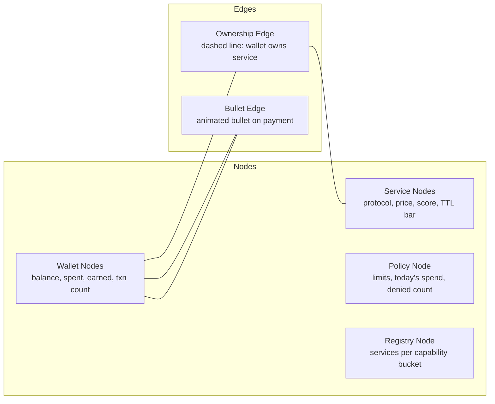
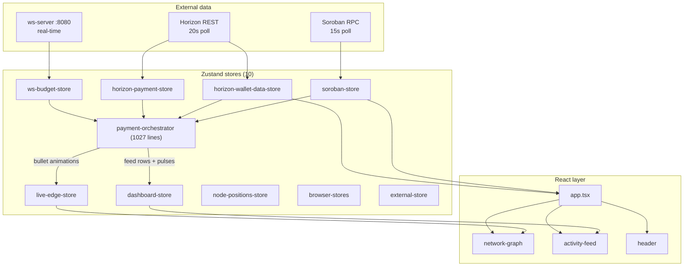

# Contract Explorer

Real-time network graph dashboard for the x402 Autopilot system. Visualizes wallets, services, and Soroban contracts as an interactive React Flow canvas with animated payment flows.

48 TypeScript/TSX source files, 7001 lines. Built on React 19, React Flow 12, Zustand 5, Tailwind CSS, and shadcn/ui (Radix primitives). Standalone Vite app, not part of the npm workspace.

## Quick start

```bash
# From the project root, the CLI dashboard launches it for you:
npm run dev          # spawns ws-server, all 4 agents, and Vite on :5180

# Standalone:
cd contract-explorer
npm install
npm run dev          # Vite dev server on :5180
```

Open `http://localhost:5180`. The dashboard auto-connects to Soroban RPC (`https://soroban-testnet.stellar.org`) and Horizon REST (`https://horizon-testnet.stellar.org`). If `ws-server` is running on `:8080`, it also connects for real-time spend events.

## What it shows



- **Wallet nodes** show USDC balance plus revenue/expenses totals and transaction count. Buyer wallets show "Spent / Balance / TX / Denied". Seller wallets show "Revenue / Expenses / Profit / Margin".
- **Service nodes** show name, protocol badge (x402 / mpp), price in USDC, trust score, and a heartbeat TTL countdown bar. Status dot is green (alive), amber (TTL low), red (expired).
- **Policy node** shows daily limit, per-tx limit, rate limit, today's spending progress, and lifetime denied count.
- **Registry node** shows total services across all capabilities with per-capability cards.
- **Bullet edges** animate from sender to receiver on every USDC payment detected via Horizon payments, Soroban events, or the ws-server WebSocket. Sub-buy edges (an agent buying from another agent) render in gold.
- **Activity feed** lists events chronologically: spends, registrations, heartbeats, denials, reclaims. Each row links to stellar.expert via the transaction hash.

## Architecture



All external data enters through Zustand stores. React components never subscribe to external sources directly. `useSyncExternalStore`-backed hooks (in `src/hooks/`) bridge stores to the render tree.

### PaymentOrchestrator (1027 lines)

The orchestrator runs outside React (initialized once at module load in `src/app.tsx`). It subscribes to all data stores and produces cross-store reactions:

1. **Horizon payment detected** (USDC transfer between known wallets) fires a glow pulse on both wallet nodes, queues a bullet animation on the connecting edge, appends a "spend" row to the activity feed
2. **Soroban spend event** (contract event log) fires the same effects, sourced from contract events instead of Horizon payments
3. **WebSocket `spend:ok`** fires immediately, with no polling delay, then merges with Horizon data when it arrives
4. **Heartbeat detected** updates the service node TTL bar and appends a "heartbeat" row
5. **Registration / deregistration** adds or removes service nodes and appends a feed row

### Data sources

| Source | Store | Poll interval | What it provides |
|--------|-------|---------------|------------------|
| Soroban RPC | `soroban-store` | 15s | Policy config, today's spend, lifetime stats, registry services per capability, contract events |
| Horizon REST | `horizon-wallet-data-store` | 20s | USDC balance and account status per tracked wallet |
| Horizon REST | `horizon-payment-store` | 20s | USDC payment history (sent and received) |
| `ws-server :8080` | `ws-budget-store` | real-time | `budget:updated` and `spend:ok` events |

### Configuration

Defaults are in `src/lib/constants.ts`. Override via URL search params:

| Param | Default | Description |
|-------|---------|-------------|
| `policy` | `CDZSYMEBO7EB3SA2DE3APMRH3MUCZIVE2RWFGSYMPHVQRJYCYT4EO6RG` | Wallet-policy contract ID |
| `registry` | `CBL2TCD7GLHLPLH4GXQO5L6DR3XACQ7WS3S3FHI2L2F7JO2WZCZTEDSP` | Trust-registry contract ID |
| `rpc` | `https://soroban-testnet.stellar.org` | Soroban RPC URL |

The wallet list is persisted to `localStorage` under `x402-autopilot.wallets.v1`. Two default wallets are seeded (`Main wallet` and `Analyst agent`); add more via the header input field.

`SEED_CAPABILITIES` in `constants.ts` polls the six live agent capabilities on every refresh: `crypto_prices`, `news`, `briefing`, `blockchain`, `market_intelligence`, `analysis`. New capabilities discovered from `register` events in the last `EVENT_LOOKBACK_LEDGERS` (17,280 ledgers, ~24 h) are merged in automatically.

## Directory layout

```
contract-explorer/src/        7001 lines, 48 files
  app.tsx                       66   shell, orchestrator init
  main.tsx                      13   React root
  vite-env.d.ts                  1

  components/
    network-graph.tsx           277  React Flow canvas
    header.tsx                  228  connection status + wallet input
    feed-event.tsx              158  single feed row
    activity-feed.tsx            93  scrollable event list
    dashboard-layout.tsx         88  resizable panels

    nodes/
      wallet-node.tsx           209  buyer/seller stats grid
      service-node.tsx          175  protocol badge + TTL bar
      registry-node.tsx         115  capability buckets
      policy-node.tsx            79  spending progress
      node-types.ts              18  React Flow type map

    edges/
      bullet-edge.tsx           154  animated payment bullet
      ownership-edge.tsx         61  dashed owner link

    ui/ (9 shadcn components)   435  badge, button, card, input,
                                     progress, scroll-area, separator,
                                     tabs, tooltip

  hooks/
    use-graph-layout.ts         592  node/edge builder from store data
    use-wallet-data-map.ts       86  merged wallet data
    use-connection-status.ts     61  online/offline per wallet
    use-browser-state.ts         50  localStorage sync
    use-node-positions.ts        17  draggable position state
    use-horizon-payments.ts      17  payment store hook
    use-horizon-wallet-data.ts   14  wallet data store hook
    use-soroban.ts               12  Soroban store hook
    use-live-edges.ts            11  edge animation hook

  stores/                      2947  Zustand state management
    payment-orchestrator.ts    1027  cross-store wiring
    horizon-wallet-data-store   470  Horizon balance polling
    soroban-store               363  Soroban RPC polling
    horizon-payment-store       333  Horizon payment history
    dashboard-store             157  feed + pulse state
    ws-budget-store             147  WebSocket client
    live-edge-store             139  bullet animation queue
    browser-stores              132  localStorage persistence
    node-positions-store        117  draggable node positions
    external-store               62  external data bridge

  lib/                         1024  helpers and types
    soroban-rpc.ts              481  Soroban simulate + event decode
    types.ts                    261  TypeScript types for contracts
    utils.ts                    106  formatters, classnames
    constants.ts                 99  defaults, polling intervals, seed caps
    horizon.ts                   77  Horizon REST client
```

## Tech stack

| Dependency | Version | Purpose |
|-----------|---------|---------|
| react | ^19.0.0 | UI framework |
| @xyflow/react | ^12.10.2 | Network graph canvas |
| zustand | ^5.0.12 | State management (10 stores) |
| @stellar/stellar-sdk | ^14.5.0 | Soroban RPC + Horizon REST |
| tailwindcss | ^3.4.17 | Utility-first CSS |
| @radix-ui/* | various | shadcn/ui primitives (button, card, progress, scroll-area, separator, tabs, tooltip) |
| @jalez/react-flow-smart-edge | ^4.0.0 | Smart edge routing |
| react-resizable-panels | ^2.1.9 | Resizable graph/feed split |
| vite | ^6.1.0 | Dev server + bundler |
| typescript | ^5.7.3 | Type checking |

## Limitations

- Soroban RPC polling is on a 15-second interval, so contract state can be up to 15 seconds stale. The ws-server WebSocket connection delivers `spend:ok` events instantly but only when the engine is running.
- Horizon payment history is paged. Very active wallets may not show their full history; the store keeps the most recent page.
- The dashboard reads Soroban contract state via `simulate` (read-only). It never sends write transactions.
- Node positions are stored in Zustand in memory. Refreshing the page resets the layout to the defaults computed by `use-graph-layout.ts`.
- The `vite-env.d.ts` file is the only `.ts` file with no actual code (1 line of types reference).

[Back to main README](../README.md)
