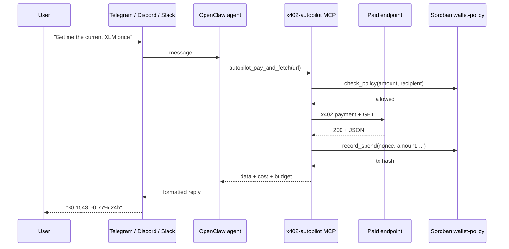

# OpenClaw Skill: x402 Autopilot

Autonomous agent payments on Stellar. This skill wraps the x402-autopilot MCP server for use with OpenClaw agents on WhatsApp, Telegram, Discord, Slack, and any other channel OpenClaw supports.

## Install

**Option A: Copy to OpenClaw skills directory**

```bash
cp -r openclaw-skill ~/.openclaw/skills/x402-autopilot
```

**Option B: Use mcporter**

```bash
mcporter install ./openclaw-skill --target openclaw
```

**Option C: Add MCP config manually**

Add to your `~/.openclaw/openclaw.json`:

```json
{
  "mcpServers": {
    "x402-autopilot": {
      "command": "npx",
      "args": ["tsx", "/path/to/stelos/mcp-server/src/index.ts"],
      "env": {
        "STELLAR_PRIVATE_KEY": "S...",
        "STELLAR_PUBLIC_KEY": "G...",
        "WALLET_POLICY_CONTRACT_ID": "C...",
        "TRUST_REGISTRY_CONTRACT_ID": "CBL2TCD7GLHLPLH4GXQO5L6DR3XACQ7WS3S3FHI2L2F7JO2WZCZTEDSP",
        "USDC_SAC_CONTRACT_ID": "CBIELTK6YBZJU5UP2WWQEUCYKLPU6AUNZ2BQ4WWFEIE3USCIHMXQDAMA",
        "OZ_API_KEY": "...",
        "ALLOW_HTTP": "true"
      }
    }
  }
}
```

The minimal `mcp.json` next to this file is the same skeleton with no secrets. Fill it in before installing.

## Requirements

- Node.js 22 or newer
- A funded Stellar testnet wallet with a USDC trustline (see the main [README.md](../README.md) Quick Start)
- An OpenZeppelin x402 facilitator API key from `https://channels.openzeppelin.com/testnet/gen`
- A deployed wallet-policy contract (`npm run deploy:wallet-policy` from the project root)
- Optional: the local agent network running (`npm run dev`) so the skill can pay your own services as well as external ones

## What happens



Every payment is a real testnet USDC transfer, verifiable on [stellar.expert](https://stellar.expert/explorer/testnet).

## Tools exposed

This skill exposes the same six MCP tools as the main project. See [SKILL.md](SKILL.md) for the manifest and tool descriptions, or [the main README](../README.md#mcp-tools) for the full list.

[Back to main README](../README.md)
